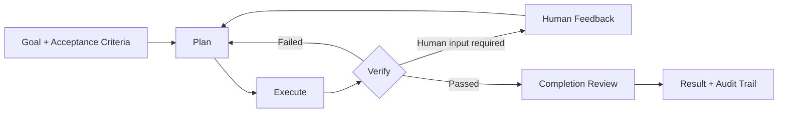

[简体中文](README.md) | English

<div align="center">

# MatterLoop

**Turn an Agent from a one-shot model call into a verifiable, pausable, and recoverable engineering loop.**

[](https://www.python.org/)
[](https://pypi.org/project/matterloop-presets/)
[](https://typing.python.org/)
[](LICENSE)

[Installation](#installation) · [Quick start](#quick-start) · [Architecture](docs/architecture.en.md) · [Enterprise integration](docs/enterprise-integration.en.md) · [Offline examples](examples/enterprise/README.en.md)

</div>

MatterLoop is a collection of independently installable Python components for building Agent systems with planning,
execution, verification, human feedback, budgets, and audit trails. It does not bind your application to a model
provider, web framework, or storage backend. Applications construct clients and infrastructure in their composition
root and inject them through protocols.

> The current version is `0.1.x`. It is suitable for prototypes, internal platforms, and architecture validation.
> Before a production deployment, read [Current boundaries](#current-boundaries) and the
> [Enterprise integration guide](docs/enterprise-integration.en.md).

## Why a Loop is necessary

Many Agents stop as soon as a model returns an answer. Engineering tasks still need to answer harder questions: Does
the result meet its acceptance criteria? Which step should be retried after a failure? How does human feedback enter
the next cycle? Where does execution resume after a service restart? How do parallel Agents avoid overwriting shared
state?

MatterLoop turns those questions into explicit control flow:



- **Recoverable pauses and blocks**: checkpoints store the plan cursor, feedback history, and revision; resume
  continues precisely by default.
- **Results must be accepted**: step-level Verifiers are separate from the overall Completion Evaluator or Team
  Reviewer.
- **Humans are part of the loop**: approve, reject, revise, and provide-input actions have idempotent semantics rather
  than relying on a chat transcript to infer state.
- **Resources have hard limits**: cycles, attempts, Tokens, cost, tool calls, and Agent tasks can be measured
  independently.
- **Components are replaceable**: models, tools, and Endpoints use per-call leases for hot replacement while existing
  calls drain safely.
- **Multi-Agent work remains controlled**: a central Orchestrator drives DAG fan-out/fan-in, and Agents cannot mutate
  global state directly.

## Installation

MatterLoop publishes 12 independent Python distributions to the
[public PyPI index](https://pypi.org/search/?q=matterloop-). Regular users do not need to clone this repository,
install uv, or build wheels locally. The root workspace is not an installable aggregate package either: this project
does not publish a `matterloop` meta-distribution. Install `matterloop-presets` or the specific components required by
your application. Every distribution supports Python 3.10–3.14.

### Install from public PyPI

For an out-of-the-box composition, install `matterloop-presets`. The artifact resolver pulls Core, Models, Runtime,
Tools, Memory, Policies, Agents, and Observability. It does not install FastAPI, Celery, Redis, or optional SDKs:

```bash
# Application development: accept compatible updates in the 0.1 series
python -m pip install --index-url https://pypi.org/simple \
  "matterloop-presets>=0.1.0,<0.2.0"

# Production and CI: pin an artifact version that you have validated
python -m pip install --index-url https://pypi.org/simple \
  "matterloop-presets==0.1.1"
```

All 12 `v0.1.1` distributions provide a wheel, an sdist, and Trusted Publishing attestations. See the
[GitHub Release](https://github.com/huleidada/matterloop/releases/tag/v0.1.1) for the corresponding release record.
Install into a virtual environment and use `python -m pip` so the artifacts go to the intended Python interpreter.

### Install components on demand

Installation uses hyphenated distribution names; Python uses underscored import names. Every distribution below can
be pulled directly from PyPI, and pip resolves its declared MatterLoop dependencies automatically.

| Capability | PyPI distribution | Python import | When to install it |
| --- | --- | --- | --- |
| Loop kernel | [`matterloop-core`](https://pypi.org/project/matterloop-core/) | `matterloop_core` | Implement your own Planner, Executor, and Verifier |
| Model abstraction | [`matterloop-models`](https://pypi.org/project/matterloop-models/) | `matterloop_models` | Model DTOs, Registry, and custom or built-in provider adapters |
| Runtime | [`matterloop-runtime`](https://pypi.org/project/matterloop-runtime/) | `matterloop_runtime` | Async, synchronous, and queue facades plus local process limits |
| Tools | [`matterloop-tools`](https://pypi.org/project/matterloop-tools/) | `matterloop_tools` | ToolRegistry, filesystem, Shell, HTTP, MCP, and Skills |
| Memory | [`matterloop-memory`](https://pypi.org/project/matterloop-memory/) | `matterloop_memory` | Long-term memory protocols and single-process in-memory checkpoints |
| Policies | [`matterloop-policies`](https://pypi.org/project/matterloop-policies/) | `matterloop_policies` | Budgets, retries, stopping, approval, and permissions |
| Agents | [`matterloop-agents`](https://pypi.org/project/matterloop-agents/) | `matterloop_agents` | Single-Agent roles and TeamLoop DAG collaboration |
| Observability | [`matterloop-observability`](https://pypi.org/project/matterloop-observability/) | `matterloop_observability` | Structured logging, tracing, and metrics |
| Presets | [`matterloop-presets`](https://pypi.org/project/matterloop-presets/) | `matterloop_presets` | Install every foundation module and use preset compositions |
| FastAPI | [`matterloop-integration-fastapi`](https://pypi.org/project/matterloop-integration-fastapi/) | `matterloop_integration_fastapi` | HTTP control-plane routes |
| Celery | [`matterloop-integration-celery`](https://pypi.org/project/matterloop-integration-celery/) | `matterloop_integration_celery` | Celery push-based task transport |
| Redis | [`matterloop-integration-redis`](https://pypi.org/project/matterloop-integration-redis/) | `matterloop_integration_redis` | Redis checkpoints, pull queue, run repository, and event publishing |

For example, install only Core and the model abstraction, or add one queue integration to the base composition:

```bash
python -m pip install "matterloop-core>=0.1.0,<0.2.0" \
  "matterloop-models>=0.1.0,<0.2.0"

python -m pip install "matterloop-presets==0.1.1" \
  "matterloop-integration-fastapi==0.1.1" \
  "matterloop-integration-celery==0.1.1"
```

Celery push queues and Redis pull queues are alternative task transports; select one for a deployment.
`RedisCheckpointStore`, Redis run repositories, and event publishers can be combined with Celery; checkpoints and
control-plane run records retain separate responsibilities.

### Optional capabilities

Provider SDKs, MCP, and OpenTelemetry are not installed by `matterloop-presets`. Select them explicitly:

```bash
# OpenAI SDK; it can also construct OpenAI-compatible clients for DeepSeek, Qwen, Zhipu, and MiniMax
python -m pip install "matterloop-models[openai]>=0.1.0,<0.2.0"

# MCP SDK and OpenTelemetry API
python -m pip install "matterloop-tools[mcp]>=0.1.0,<0.2.0" \
  "matterloop-observability[otel]>=0.1.0,<0.2.0"
```

The application still constructs and injects SDK clients, model names, endpoints, connection pools, and credentials.
MatterLoop source packages do not read `.env` files or environment variables. Applications that implement their own
`ModelClient` or a provider's minimal client Protocol do not need the `openai` extra.

### Install from an enterprise artifact repository

In an enterprise environment, repository administrators should synchronize approved MatterLoop wheels and their
transitive dependencies to one [PEP 503](https://peps.python.org/pep-0503/) Simple Index. Install only from that
index:

```bash
python -m pip install \
  --index-url https://packages.example.com/repository/pypi/simple \
  "matterloop-presets==0.1.1"
```

- Use one enterprise index that proxies public PyPI, or ensure it contains all eight foundation distributions and
  approved third-party dependencies.
- Supply credentials through pip configuration, the system keyring, or CI secrets. Never place usernames or tokens
  in commands, URLs, READMEs, or source code.
- Enforce TLS. Distribute a private CA through system or pip certificate configuration instead of bypassing
  verification with `--trusted-host`.
- Do not combine the private index with public PyPI through `--extra-index-url`; this prevents dependency-confusion
  selection between same-named packages.
- In production, use an organization-owned constraints/hash manifest to pin every transitive artifact in addition to
  the top-level version.

Air-gapped environments can install from a scanned and approved wheelhouse without building from source:

```bash
python -m pip install --no-index --find-links /opt/matterloop-wheelhouse \
  "matterloop-presets==0.1.1"
```

### Verify the installation

Check dependencies and public imports in a clean virtual environment so the local workspace cannot hide a missing
dependency:

```bash
python -m pip check
python -c "from importlib.metadata import version; import matterloop_core, matterloop_presets; print(version('matterloop-presets'))"
```

The expected version is `0.1.1`, and `pip check` should report `No broken requirements found`.

## Quick start

After installation, start from a preset. `model_client` is a `ModelClient` already constructed by the application;
MatterLoop does not read credentials or environment variables.

```python
from matterloop_core import LoopRequest
from matterloop_presets import build_minimal_runtime


async def run(model_client):
    async with build_minimal_runtime(model=model_client) as runtime:
        return await runtime.run(
            LoopRequest(
                goal="Generate release notes and validate them",
                acceptance_criteria=(
                    "Include every user-visible change",
                    "Provide verification evidence for each conclusion",
                ),
            )
        )
```

When you need a provider adapter, import it on demand from `matterloop_models.providers`. The application decides the
SDK client, model name, endpoint, connection pool, and credentials:

```python
from matterloop_models.providers import OpenAIModelClient, OpenAIModelConfig

model_client = OpenAIModelClient(
    OpenAIModelConfig(model="your-model"),
    client=application_created_sdk_client,
    owns_client=False,
)
```

Complete offline composition examples live in [`examples/enterprise`](examples/enterprise/README.en.md). To start
from the minimal Core protocols, see the [`matterloop-core` quick start](matterloop-core/README.en.md).

## Choose a runtime

| Requirement | Entry point | State and execution model |
| --- | --- | --- |
| Embed in an asynchronous service | `AsyncRuntime` | Runs in the current process; checkpoint implementation is replaceable |
| Embed in a synchronous application | `LocalRuntime` | Dedicated event-loop thread; blocking synchronous API |
| Run multiple Agents in parallel | `AsyncTeamRuntime` | DAG, capability routing, task verification, and team review |
| Separate API and Worker | `QueueRuntime` | Control plane only enqueues and queries; Workers execute independently and commit with CAS |

Four presets provide practical starting points:

- `minimal`: no dangerous tools; suitable for model workflows and tests.
- `coding`: read-only files by default; writes and allowlisted commands require approval.
- `research`: read-only files, an HTTPS host allowlist, and an evidence threshold.
- `production`: requires external Queue, RunRepository, CheckpointStore, and audit Publisher implementations; it does
  not fall back to memory.

## Current boundaries

- In-memory checkpoints, memory, queues, repositories, and TeamRepository implementations are intended only for tests
  or single-process execution.
- `LocalProcessSandbox` limits cwd, environment, time, and output; it does not isolate malicious code, networking, or
  system calls.
- Tool registries allow calls when no Authorizer is supplied. Production deployments must integrate identity, tenant
  permissions, and auditing.
- Redis checkpoints provide no TTL, listing, deletion, or cross-key transaction. Celery and the Redis pull queue are
  alternative transport models and should not consume the same work together.
- The FastAPI integration currently has no route for submitting human feedback. Applications must add that surface to
  complete HTTP HITL.
- `UsageLedger` is an atomic in-process ledger, not a cross-instance quota service or a provider invoice.
- Default tests are fully offline. The live DeepSeek test is a separate, paid, opt-in workflow.

## Source development (contributors)

The following commands are for repository contributors, not user installation. This repository uses a uv workspace
to manage 12 independently buildable distributions:

```bash
uv sync --all-extras --dev
uv run ruff format --check .
uv run ruff check .
uv run mypy
uv run pytest
uv run python scripts/check_dependencies.py
uv build --all-packages
```

Python 3.10–3.14 is supported. Every public package includes `py.typed`; public comments and Google-style Docstrings
are written in Chinese, while public Markdown is maintained in Simplified Chinese and English.

## Documentation

- [Architecture](docs/architecture.en.md): runtime invariants, dependency boundaries, HITL/CAS, hot replacement, and
  extension points.
- [Enterprise integration](docs/enterprise-integration.en.md): deployment topologies, resource ownership, tenant
  isolation, auditing, and production readiness.
- [Public PyPI releases](docs/releasing.en.md): Trusted Publishing configuration, version workflow, verification, and
  incident handling.
- [Documentation internationalization](docs/i18n.en.md): locale filenames, language switch links, translation
  boundaries, and contract tests.
- [Changelog](CHANGELOG.en.md): user-visible changes across all 12 distributions under one version.
- [Offline composition examples](examples/enterprise/README.en.md): single-Agent, TeamLoop, queue service, and
  MCP/Skills examples.
- Each distribution README: minimal integration, key APIs, failure semantics, and the package's actual security
  boundary.

## License

[MIT](LICENSE) © 2026 MatterLoop Contributors
