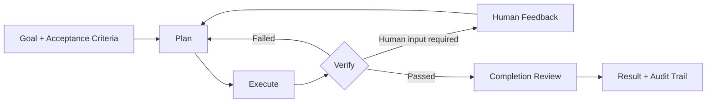

[简体中文](README.md) | English

<div align="center">

# MatterLoop

**Turn an Agent from a one-shot model call into a verifiable, pausable, and recoverable engineering loop.**

[](https://www.python.org/)
[](https://pypi.org/project/matterloop-presets/)
[](https://typing.python.org/)
[](LICENSE)

[Quick start](#quick-start) · [Architecture](docs/architecture.en.md) · [Enterprise integration](docs/enterprise-integration.en.md) · [Release guide](docs/releasing.en.md) · [Offline examples](examples/enterprise/README.en.md)

</div>

MatterLoop is a collection of independently installable Python components for building Agent systems with planning,
execution, verification, human feedback, budgets, and audit trails. It does not bind your application to a model
provider, web framework, or storage backend. Applications construct clients and infrastructure in their composition
root and inject them through protocols.

> The current version is `0.1.x`. It is suitable for prototypes, internal platforms, and architecture validation.
> Before a production deployment, read [Current boundaries](#current-boundaries) and the
> [Enterprise integration guide](docs/enterprise-integration.en.md).

## Why a Loop is necessary

Many Agents stop as soon as a model returns an answer. Engineering tasks still need to answer harder questions: Does
the result meet its acceptance criteria? Which step should be retried after a failure? How does human feedback enter
the next cycle? Where does execution resume after a service restart? How do parallel Agents avoid overwriting shared
state?

MatterLoop turns those questions into explicit control flow:



- **Recoverable pauses and blocks**: checkpoints store the plan cursor, feedback history, and revision; resume
  continues precisely by default.
- **Results must be accepted**: step-level Verifiers are separate from the overall Completion Evaluator or Team
  Reviewer.
- **Humans are part of the loop**: approve, reject, revise, and provide-input actions have idempotent semantics rather
  than relying on a chat transcript to infer state.
- **Resources have hard limits**: cycles, attempts, Tokens, cost, tool calls, and Agent tasks can be measured
  independently.
- **Components are replaceable**: models, tools, and Endpoints use per-call leases for hot replacement while existing
  calls drain safely.
- **Multi-Agent work remains controlled**: a central Orchestrator drives DAG fan-out/fan-in, and Agents cannot mutate
  global state directly.

## Quick start

The shortest path is a preset. `model_client` is a `ModelClient` already constructed by the application; MatterLoop
does not read credentials or environment variables. Every distribution requires Python 3.10 or later.

> `v0.1.0` is available on public PyPI. All 12 distributions provide a wheel, an sdist, and Trusted Publishing
> attestations. See the [GitHub Release](https://github.com/huleidada/matterloop/releases/tag/v0.1.0) for the release
> record.

```bash
pip install matterloop-presets
```

```python
from matterloop_core import LoopRequest
from matterloop_presets import build_minimal_runtime


async def run(model_client):
    async with build_minimal_runtime(model=model_client) as runtime:
        return await runtime.run(
            LoopRequest(
                goal="Generate release notes and validate them",
                acceptance_criteria=(
                    "Include every user-visible change",
                    "Provide verification evidence for each conclusion",
                ),
            )
        )
```

When you need a provider adapter, import it on demand from `matterloop_models.providers`. The application decides the
SDK client, model name, endpoint, connection pool, and credentials:

```python
from matterloop_models.providers import OpenAIModelClient, OpenAIModelConfig

model_client = OpenAIModelClient(
    OpenAIModelConfig(model="your-model"),
    client=application_created_sdk_client,
    owns_client=False,
)
```

Complete offline composition examples live in [`examples/enterprise`](examples/enterprise/README.en.md). To start
from the minimal Core protocols, see the [`matterloop-core` quick start](matterloop-core/README.en.md).

## Choose a runtime

| Requirement | Entry point | State and execution model |
| --- | --- | --- |
| Embed in an asynchronous service | `AsyncRuntime` | Runs in the current process; checkpoint implementation is replaceable |
| Embed in a synchronous application | `LocalRuntime` | Dedicated event-loop thread; blocking synchronous API |
| Run multiple Agents in parallel | `AsyncTeamRuntime` | DAG, capability routing, task verification, and team review |
| Separate API and Worker | `QueueRuntime` | Control plane only enqueues and queries; Workers execute independently and commit with CAS |

Four presets provide practical starting points:

- `minimal`: no dangerous tools; suitable for model workflows and tests.
- `coding`: read-only files by default; writes and allowlisted commands require approval.
- `research`: read-only files, an HTTPS host allowlist, and an evidence threshold.
- `production`: requires external Queue, RunRepository, CheckpointStore, and audit Publisher implementations; it does
  not fall back to memory.

## Install only what you need

Each directory is an independent distribution. Import names use underscores, so `matterloop-core` maps to
`matterloop_core`. Source code lives directly under `src/python/matterloop_xxx`. You can install only the components
you use, for example `pip install matterloop-core matterloop-models`, or install `matterloop-presets` for a complete
base composition.

| Layer | Distribution | Responsibility |
| --- | --- | --- |
| Loop kernel | [`matterloop-core`](matterloop-core/README.en.md) | State machine, HITL, checkpoints, events, and extension protocols |
| Models | [`matterloop-models`](matterloop-models/README.en.md) | Provider-neutral DTOs, Registry, and OpenAI/DeepSeek/Qwen/Zhipu/MiniMax adapters |
| Agents | [`matterloop-agents`](matterloop-agents/README.en.md) | Planner, Worker, Verifier, and TeamLoop DAG |
| Tools | [`matterloop-tools`](matterloop-tools/README.en.md) | ToolRegistry, MCP, Skills, filesystem, Shell, and HTTP |
| Policies and data | [`matterloop-policies`](matterloop-policies/README.en.md) · [`matterloop-memory`](matterloop-memory/README.en.md) | Budgets, approvals, and permissions; long-term memory and in-memory checkpoints |
| Runtime and observability | [`matterloop-runtime`](matterloop-runtime/README.en.md) · [`matterloop-observability`](matterloop-observability/README.en.md) | Async, synchronous, and queue facades; logging, metrics, and tracing |
| Composition | [`matterloop-presets`](matterloop-presets/README.en.md) | `minimal`, `coding`, `research`, and `production` assemblies |
| Framework integration | [`FastAPI`](matterloop-integration-fastapi/README.en.md) · [`Celery`](matterloop-integration-celery/README.en.md) · [`Redis`](matterloop-integration-redis/README.en.md) | Thin adapters that contain no orchestration logic |

Dependencies always point from composition layers toward foundation layers. `matterloop-core` imports no sibling
distribution. See the [architecture guide](docs/architecture.en.md#distribution-dependency-boundaries) for the full
allowlist.

## Current boundaries

- In-memory checkpoints, memory, queues, repositories, and TeamRepository implementations are intended only for tests
  or single-process execution.
- `LocalProcessSandbox` limits cwd, environment, time, and output; it does not isolate malicious code, networking, or
  system calls.
- Tool registries allow calls when no Authorizer is supplied. Production deployments must integrate identity, tenant
  permissions, and auditing.
- The Redis integration does not provide a CheckpointStore. Celery and the Redis pull queue are alternative transport
  models and should not consume the same work together.
- The FastAPI integration currently has no route for submitting human feedback. Applications must add that surface to
  complete HTTP HITL.
- `UsageLedger` is an atomic in-process ledger, not a cross-instance quota service or a provider invoice.
- Default tests are fully offline. The live DeepSeek test is a separate, paid, opt-in workflow.

## Development

This repository uses a uv workspace to manage 12 independently buildable distributions:

```bash
uv sync --all-extras --dev
uv run ruff format --check .
uv run ruff check .
uv run mypy
uv run pytest
uv run python scripts/check_dependencies.py
uv build --all-packages
```

Python 3.10–3.14 is supported. Every public package includes `py.typed`; public comments and Google-style Docstrings
are written in Chinese, while public Markdown is maintained in Simplified Chinese and English. The isolated paid
smoke-test workflow is documented in
[`docs/live-deepseek.en.md`](docs/live-deepseek.en.md).

## Documentation

- [Architecture](docs/architecture.en.md): runtime invariants, dependency boundaries, HITL/CAS, hot replacement, and
  extension points.
- [Enterprise integration](docs/enterprise-integration.en.md): deployment topologies, resource ownership, tenant
  isolation, auditing, and production readiness.
- [Public PyPI releases](docs/releasing.en.md): Trusted Publishing configuration, version workflow, verification, and
  incident handling.
- [Documentation internationalization](docs/i18n.en.md): locale filenames, language switch links, translation
  boundaries, and contract tests.
- [Changelog](CHANGELOG.en.md): user-visible changes across all 12 distributions under one version.
- [Offline composition examples](examples/enterprise/README.en.md): single-Agent, TeamLoop, queue service, and
  MCP/Skills examples.
- Each distribution README: minimal integration, key APIs, failure semantics, and the package's actual security
  boundary.

## License

[MIT](LICENSE) © 2026 MatterLoop Contributors
