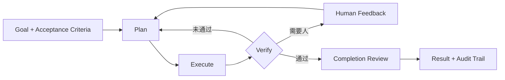

<div align="center">

# MatterLoop

**把 Agent 从“一次模型调用”变成可验证、可暂停、可恢复的工程闭环。**

[](https://www.python.org/)
[](https://typing.python.org/)
[](LICENSE)

[快速开始](#快速开始) · [架构](docs/architecture.md) · [企业集成](docs/enterprise-integration.md) · [发布指南](docs/releasing.md) · [离线示例](examples/enterprise/)

</div>

MatterLoop 是一组可独立安装的 Python 组件，用来构建带计划、执行、验证、人工反馈、预算和审计的
Agent 系统。它不绑定模型供应商、Web 框架或存储后端；应用在组合根创建客户端和基础设施，再通过
协议注入。

> 当前版本为 `0.1.x`。适合原型、内部平台和架构验证；生产部署前请阅读
> [当前边界](#当前边界) 与 [企业集成指南](docs/enterprise-integration.md)。

## 为什么需要 Loop

许多 Agent 在模型输出答案后就结束了。工程任务还需要回答：结果是否满足验收条件？失败后重试
哪一步？人工意见如何进入下一轮？服务重启后从哪里继续？并行 Agent 如何避免覆盖彼此状态？

MatterLoop 把这些问题变成明确的控制流：



- **暂停/阻塞可恢复**：checkpoint 保存计划游标、反馈历史和 revision；恢复默认精确继续。
- **结果要验收**：步骤 Verifier 与整体 Completion Evaluator/Team Reviewer 分离。
- **人类在闭环内**：批准、拒绝、修订和补充输入都有幂等语义，不靠聊天记录猜状态。
- **资源有硬边界**：cycle、attempt、Token、费用、工具调用和 Agent 任务可以分别计量。
- **组件可替换**：模型、工具和 Endpoint 按调用租约热替换，旧调用安全排空。
- **多智能体可控制**：中心 Orchestrator 驱动 DAG fan-out/fan-in，Agent 不能直接改全局状态。

## 快速开始

最短路径是使用 preset。`model_client` 是应用已经构造好的 `ModelClient`；MatterLoop 不读取密钥或
环境变量。所有发行包要求 Python 3.10 或更高版本。

> 公共 PyPI 首发正在准备中。以下命令从首个公开版本成功发布到 PyPI 后可用；首发完成前请使用
> uv workspace 运行源码。发布状态和可信发布流程见[发布指南](docs/releasing.md)。

```bash
pip install matterloop-presets
```

```python
from matterloop_core import LoopRequest
from matterloop_presets import build_minimal_runtime


async def run(model_client):
    async with build_minimal_runtime(model=model_client) as runtime:
        return await runtime.run(
            LoopRequest(
                goal="生成发布说明并自检",
                acceptance_criteria=(
                    "包含用户可感知的变更",
                    "每项结论都有验证依据",
                ),
            )
        )
```

需要供应商适配器时，从 `matterloop_models.providers` 按需导入。SDK client、模型名、端点、连接池
和凭据均由应用决定：

```python
from matterloop_models.providers import OpenAIModelClient, OpenAIModelConfig

model_client = OpenAIModelClient(
    OpenAIModelConfig(model="your-model"),
    client=application_created_sdk_client,
    owns_client=False,
)
```

完整且不联网的装配代码在 [`examples/enterprise`](examples/enterprise/)。如果希望从最小 Core
协议开始，请看 [`matterloop-core` Quickstart](matterloop-core/README.md#最小可运行装配)。

## 选择运行方式

| 需求 | 入口 | 状态与执行方式 |
| --- | --- | --- |
| 嵌入现有异步服务 | `AsyncRuntime` | 当前进程执行；checkpoint 可替换 |
| 嵌入同步程序 | `LocalRuntime` | 专用事件循环线程；同步阻塞 API |
| 多 Agent 并行协作 | `AsyncTeamRuntime` | DAG、能力路由、任务验证和团队审查 |
| API 与 Worker 分离 | `QueueRuntime` | 控制面只入队/查询；Worker 独立执行并用 CAS 提交 |

四套 preset 提供常见起点：

- `minimal`：无危险工具，适合模型流程和测试。
- `coding`：只读文件为默认能力，写入与白名单命令进入审批。
- `research`：只读文件、HTTPS host allowlist 和引用门槛。
- `production`：要求外部 Queue、RunRepository、CheckpointStore 和审计 Publisher，不做内存回退。

## 按需安装

每个目录都是独立发行包，导入名使用下划线形式，例如 `matterloop-core` 对应
`matterloop_core`。源码直接位于 `src/python/matterloop_xxx`。从首个公开 Release 起，可以只安装
实际使用的组件，例如 `pip install matterloop-core matterloop-models`；需要完整基础装配时安装
`matterloop-presets`。

| 层 | 发行包 | 作用 |
| --- | --- | --- |
| 闭环内核 | [`matterloop-core`](matterloop-core/) | 状态机、HITL、checkpoint、事件和扩展协议 |
| 模型 | [`matterloop-models`](matterloop-models/) | 中立 DTO、Registry、OpenAI/DeepSeek/千问/智谱/MiniMax 适配器 |
| Agent | [`matterloop-agents`](matterloop-agents/) | Planner、Worker、Verifier 与 TeamLoop DAG |
| 工具 | [`matterloop-tools`](matterloop-tools/) | ToolRegistry、MCP、Skills、文件、Shell 和 HTTP |
| 策略与数据 | [`matterloop-policies`](matterloop-policies/) · [`matterloop-memory`](matterloop-memory/) | 预算/审批/权限；长期记忆与内存 checkpoint |
| 运行与观测 | [`matterloop-runtime`](matterloop-runtime/) · [`matterloop-observability`](matterloop-observability/) | 异步/同步/队列门面；日志、指标、Trace |
| 组合 | [`matterloop-presets`](matterloop-presets/) | minimal、coding、research、production 装配 |
| 框架集成 | [`FastAPI`](matterloop-integration-fastapi/) · [`Celery`](matterloop-integration-celery/) · [`Redis`](matterloop-integration-redis/) | 薄适配层，不承载编排逻辑 |

依赖始终从组合层指向基础层，`matterloop-core` 不导入任何兄弟包。完整白名单见
[架构说明](docs/architecture.md#发行包依赖边界)。

## 当前边界

- 内存 checkpoint、记忆、队列、仓储和 TeamRepository 只适合测试或单进程运行。
- `LocalProcessSandbox` 只限制 cwd、环境、超时和输出，不隔离恶意代码、网络或系统调用。
- 工具注册表在未传 Authorizer 时默认放行；生产环境必须接入身份、租户权限和审计。
- Redis 集成不提供 CheckpointStore；Celery 与 Redis 拉取队列是两种任务传输方式，不应叠加消费。
- FastAPI 集成当前没有提交人工反馈的路由，完整 HTTP HITL 需要应用层补充。
- `UsageLedger` 是进程内原子账本，不是跨实例额度服务或供应商账单。
- 默认测试完全离线；真实 DeepSeek 测试是单独的付费 opt-in 流程。

## 开发

仓库使用 uv workspace 管理 12 个可独立构建的包：

```bash
uv sync --all-extras --dev
uv run ruff format --check .
uv run ruff check .
uv run mypy
uv run pytest
uv run python scripts/check_dependencies.py
uv build --all-packages
```

Python 支持 3.10–3.14。所有公共包提供 `py.typed`；公共注释与 Google 风格 Docstring 使用中文。
付费冒烟测试的隔离流程见 [`docs/live-deepseek.md`](docs/live-deepseek.md)。

## 文档

- [架构说明](docs/architecture.md)：运行不变量、依赖边界、HITL/CAS、热替换和扩展位置。
- [企业集成指南](docs/enterprise-integration.md)：部署拓扑、资源所有权、租户隔离、审计和上线检查。
- [公共 PyPI 发布指南](docs/releasing.md)：可信发布配置、版本流程、验证与故障处置。
- [变更记录](CHANGELOG.md)：按统一版本记录 12 个发行包的用户可感知变化。
- [离线装配示例](examples/enterprise/)：单 Agent、TeamLoop、队列服务及 MCP/Skills。
- 各发行包 README：最小接入、关键 API、失败语义和该包的真实安全边界。

## License

[MIT](LICENSE) © 2026 MatterLoop Contributors
