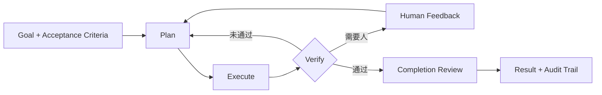

简体中文 | [English](README.en.md)

<div align="center">

# MatterLoop

**把 Agent 从“一次模型调用”变成可验证、可暂停、可恢复的工程闭环。**

[](https://www.python.org/)
[](https://pypi.org/project/matterloop-presets/)
[](https://typing.python.org/)
[](LICENSE)

[安装](#安装) · [快速开始](#快速开始) · [架构](docs/architecture.md) · [企业集成](docs/enterprise-integration.md) · [离线示例](examples/enterprise/)

</div>

MatterLoop 是一组可独立安装的 Python 组件，用来构建带计划、执行、验证、人工反馈、预算和审计的
Agent 系统。它不绑定模型供应商、Web 框架或存储后端；应用在组合根创建客户端和基础设施，再通过
协议注入。

> 当前版本为 `0.1.x`。适合原型、内部平台和架构验证；生产部署前请阅读
> [当前边界](#当前边界) 与 [企业集成指南](docs/enterprise-integration.md)。

## 为什么需要 Loop

许多 Agent 在模型输出答案后就结束了。工程任务还需要回答：结果是否满足验收条件？失败后重试
哪一步？人工意见如何进入下一轮？服务重启后从哪里继续？并行 Agent 如何避免覆盖彼此状态？

MatterLoop 把这些问题变成明确的控制流：



- **暂停/阻塞可恢复**：checkpoint 保存计划游标、反馈历史和 revision；恢复默认精确继续。
- **结果要验收**：步骤 Verifier 与整体 Completion Evaluator/Team Reviewer 分离。
- **人类在闭环内**：批准、拒绝、修订和补充输入都有幂等语义，不靠聊天记录猜状态。
- **资源有硬边界**：cycle、attempt、Token、费用、工具调用和 Agent 任务可以分别计量。
- **组件可替换**：模型、工具和 Endpoint 按调用租约热替换，旧调用安全排空。
- **多智能体可控制**：中心 Orchestrator 驱动 DAG fan-out/fan-in，Agent 不能直接改全局状态。

## 安装

MatterLoop 以 12 个独立 Python 发行包发布到[公共 PyPI](https://pypi.org/search/?q=matterloop-)。
普通用户不需要克隆仓库、安装 uv 或在本地构建 wheel。根 workspace 也不是可安装的总包：项目没有发布
名为 `matterloop` 的元发行包，请根据场景安装 `matterloop-presets` 或具体组件。所有发行包要求
Python 3.10–3.14。

### 从公共 PyPI 安装

开箱装配推荐安装 `matterloop-presets`。它会从制品索引拉取 Core、Models、Runtime、Tools、Memory、
Policies、Agents 和 Observability，不会安装 FastAPI、Celery、Redis 或可选 SDK：

```bash
# 应用开发：跟随 0.1 系列的兼容更新
python -m pip install --index-url https://pypi.org/simple \
  "matterloop-presets>=0.1.0,<0.2.0"

# 生产与 CI：固定经过验证的制品版本
python -m pip install --index-url https://pypi.org/simple \
  "matterloop-presets==0.1.0"
```

`v0.1.0` 的 12 个发行包均已提供 wheel、sdist 和 Trusted Publishing 发布证明；对应的发布记录见
[GitHub Release](https://github.com/huleidada/matterloop/releases/tag/v0.1.0)。建议在虚拟环境中安装，
并始终使用 `python -m pip`，确保制品进入当前 Python 解释器。

### 按需安装组件

安装命令使用连字符发行名，Python 代码使用下划线导入名。下表中的包都可以直接从 PyPI 单独拉取；
声明的 MatterLoop 内部依赖会由 pip 自动解析。

| 能力 | PyPI 发行包 | Python 导入名 | 安装场景 |
| --- | --- | --- | --- |
| 闭环内核 | [`matterloop-core`](https://pypi.org/project/matterloop-core/) | `matterloop_core` | 只实现自己的 Planner、Executor 和 Verifier |
| 模型抽象 | [`matterloop-models`](https://pypi.org/project/matterloop-models/) | `matterloop_models` | 模型 DTO、Registry、自定义或内置供应商适配 |
| Runtime | [`matterloop-runtime`](https://pypi.org/project/matterloop-runtime/) | `matterloop_runtime` | 异步、同步、队列门面和本地进程限制 |
| Tools | [`matterloop-tools`](https://pypi.org/project/matterloop-tools/) | `matterloop_tools` | ToolRegistry、文件、Shell、HTTP、MCP 和 Skills |
| Memory | [`matterloop-memory`](https://pypi.org/project/matterloop-memory/) | `matterloop_memory` | 长期记忆协议和单进程内存 checkpoint |
| Policies | [`matterloop-policies`](https://pypi.org/project/matterloop-policies/) | `matterloop_policies` | 预算、重试、停止、审批和权限 |
| Agents | [`matterloop-agents`](https://pypi.org/project/matterloop-agents/) | `matterloop_agents` | 单 Agent 角色与 TeamLoop DAG 协作 |
| Observability | [`matterloop-observability`](https://pypi.org/project/matterloop-observability/) | `matterloop_observability` | 结构化日志、Tracing 和 Metrics |
| Presets | [`matterloop-presets`](https://pypi.org/project/matterloop-presets/) | `matterloop_presets` | 一次安装全部基础模块并使用预设装配 |
| FastAPI | [`matterloop-integration-fastapi`](https://pypi.org/project/matterloop-integration-fastapi/) | `matterloop_integration_fastapi` | HTTP 控制面路由 |
| Celery | [`matterloop-integration-celery`](https://pypi.org/project/matterloop-integration-celery/) | `matterloop_integration_celery` | Celery 推送式任务传输 |
| Redis | [`matterloop-integration-redis`](https://pypi.org/project/matterloop-integration-redis/) | `matterloop_integration_redis` | Redis 拉取队列、运行仓储和事件发布 |

例如，只安装 Core 和模型抽象，或在基础装配上增加一种队列集成：

```bash
python -m pip install "matterloop-core>=0.1.0,<0.2.0" \
  "matterloop-models>=0.1.0,<0.2.0"

python -m pip install "matterloop-presets==0.1.0" \
  "matterloop-integration-fastapi==0.1.0" \
  "matterloop-integration-celery==0.1.0"
```

Celery 推送队列与 Redis 拉取队列是两种任务传输方案，按部署方式二选一。Redis 的运行仓储和事件发布
可以与 Celery 组合，但 Redis 集成不提供持久化 `CheckpointStore`。

### 可选能力

供应商 SDK、MCP 和 OpenTelemetry 不会随 `matterloop-presets` 自动安装，应显式选择：

```bash
# OpenAI SDK；也可用于 DeepSeek、千问、智谱和 MiniMax 的 OpenAI-compatible 客户端
python -m pip install "matterloop-models[openai]>=0.1.0,<0.2.0"

# MCP SDK 与 OpenTelemetry API
python -m pip install "matterloop-tools[mcp]>=0.1.0,<0.2.0" \
  "matterloop-observability[otel]>=0.1.0,<0.2.0"
```

SDK client、模型名、端点、连接池和凭据仍由应用构造并注入；MatterLoop 源码不会读取 `.env` 或环境
变量。若应用实现自己的 `ModelClient` 或最小供应商 client Protocol，则不需要安装 `openai` extra。

### 从企业制品仓库安装

企业环境应让仓库管理员把已批准的 MatterLoop wheel 及其传递依赖同步到一个符合
[PEP 503](https://peps.python.org/pep-0503/) 的 Simple Index，然后只从该索引安装：

```bash
python -m pip install \
  --index-url https://packages.example.com/repository/pypi/simple \
  "matterloop-presets==0.1.0"
```

- 使用能够代理公共 PyPI 的单一企业索引，或确保其中包含 8 个基础发行包及批准的第三方依赖。
- 凭据通过 pip 配置、系统 keyring 或 CI Secret 注入，不把用户名、Token 写入命令、URL、README 或源码。
- 使用 TLS；私有 CA 通过系统或 pip 证书配置下发，不用 `--trusted-host` 绕过证书校验。
- 不把私库与公共 PyPI 通过 `--extra-index-url` 混用，避免同名包造成 dependency confusion。
- 生产环境除固定顶层版本外，还应使用组织维护的 constraints/哈希清单锁定全部传递制品。

隔离网络可从经过扫描和批准的 wheelhouse 安装，同样不需要源码构建：

```bash
python -m pip install --no-index --find-links /opt/matterloop-wheelhouse \
  "matterloop-presets==0.1.0"
```

### 验证安装

在干净虚拟环境中检查依赖与公开导入名，避免本地 workspace 掩盖漏装依赖：

```bash
python -m pip check
python -c "from importlib.metadata import version; import matterloop_core, matterloop_presets; print(version('matterloop-presets'))"
```

预期输出版本 `0.1.0`，且 `pip check` 报告 `No broken requirements found`。

## 快速开始

完成安装后，可以从 preset 开始。`model_client` 是应用已经构造好的 `ModelClient`；MatterLoop 不读取
密钥或环境变量。

```python
from matterloop_core import LoopRequest
from matterloop_presets import build_minimal_runtime


async def run(model_client):
    async with build_minimal_runtime(model=model_client) as runtime:
        return await runtime.run(
            LoopRequest(
                goal="生成发布说明并自检",
                acceptance_criteria=(
                    "包含用户可感知的变更",
                    "每项结论都有验证依据",
                ),
            )
        )
```

需要供应商适配器时，从 `matterloop_models.providers` 按需导入。SDK client、模型名、端点、连接池
和凭据均由应用决定：

```python
from matterloop_models.providers import OpenAIModelClient, OpenAIModelConfig

model_client = OpenAIModelClient(
    OpenAIModelConfig(model="your-model"),
    client=application_created_sdk_client,
    owns_client=False,
)
```

完整且不联网的装配代码在 [`examples/enterprise`](examples/enterprise/)。如果希望从最小 Core
协议开始，请看 [`matterloop-core` Quickstart](matterloop-core/README.md#最小可运行装配)。

## 选择运行方式

| 需求 | 入口 | 状态与执行方式 |
| --- | --- | --- |
| 嵌入现有异步服务 | `AsyncRuntime` | 当前进程执行；checkpoint 可替换 |
| 嵌入同步程序 | `LocalRuntime` | 专用事件循环线程；同步阻塞 API |
| 多 Agent 并行协作 | `AsyncTeamRuntime` | DAG、能力路由、任务验证和团队审查 |
| API 与 Worker 分离 | `QueueRuntime` | 控制面只入队/查询；Worker 独立执行并用 CAS 提交 |

四套 preset 提供常见起点：

- `minimal`：无危险工具，适合模型流程和测试。
- `coding`：只读文件为默认能力，写入与白名单命令进入审批。
- `research`：只读文件、HTTPS host allowlist 和引用门槛。
- `production`：要求外部 Queue、RunRepository、CheckpointStore 和审计 Publisher，不做内存回退。

## 当前边界

- 内存 checkpoint、记忆、队列、仓储和 TeamRepository 只适合测试或单进程运行。
- `LocalProcessSandbox` 只限制 cwd、环境、超时和输出，不隔离恶意代码、网络或系统调用。
- 工具注册表在未传 Authorizer 时默认放行；生产环境必须接入身份、租户权限和审计。
- Redis 集成不提供 CheckpointStore；Celery 与 Redis 拉取队列是两种任务传输方式，不应叠加消费。
- FastAPI 集成当前没有提交人工反馈的路由，完整 HTTP HITL 需要应用层补充。
- `UsageLedger` 是进程内原子账本，不是跨实例额度服务或供应商账单。
- 默认测试完全离线；真实 DeepSeek 测试是单独的付费 opt-in 流程。

## 参与开发（源码仓库）

以下命令只面向仓库贡献者，不是用户安装方式。仓库使用 uv workspace 管理 12 个可独立构建的包：

```bash
uv sync --all-extras --dev
uv run ruff format --check .
uv run ruff check .
uv run mypy
uv run pytest
uv run python scripts/check_dependencies.py
uv build --all-packages
```

Python 支持 3.10–3.14。所有公共包提供 `py.typed`；公共注释与 Google 风格 Docstring 使用中文，
公开 Markdown 同步维护简体中文和英文。付费冒烟测试的隔离流程见
[`docs/live-deepseek.md`](docs/live-deepseek.md)。

## 文档

- [架构说明](docs/architecture.md)：运行不变量、依赖边界、HITL/CAS、热替换和扩展位置。
- [企业集成指南](docs/enterprise-integration.md)：部署拓扑、资源所有权、租户隔离、审计和上线检查。
- [公共 PyPI 发布指南](docs/releasing.md)：可信发布配置、版本流程、验证与故障处置。
- [文档国际化规范](docs/i18n.md)：语言文件命名、切换链接、翻译边界和契约测试。
- [变更记录](CHANGELOG.md)：按统一版本记录 12 个发行包的用户可感知变化。
- [离线装配示例](examples/enterprise/)：单 Agent、TeamLoop、队列服务及 MCP/Skills。
- 各发行包 README：最小接入、关键 API、失败语义和该包的真实安全边界。

## License

[MIT](LICENSE) © 2026 MatterLoop Contributors
