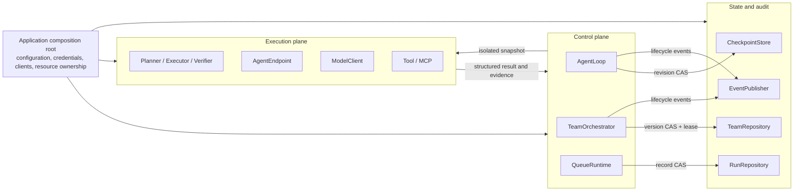
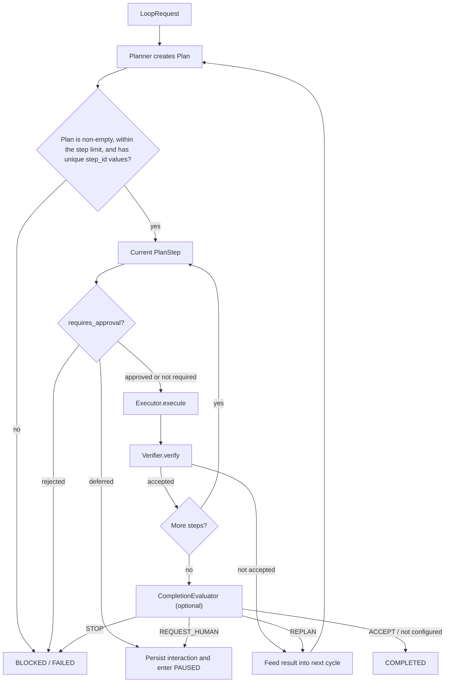

[简体中文](architecture.md) | English

# MatterLoop Architecture

This is neither a distribution inventory nor an installation manual. It records the constraints that maintainers
must not casually break: who may modify runtime state, where a resumed run continues, how parallel tasks converge,
and where the system must stop after an external component fails.

See the [Enterprise Integration Guide](enterprise-integration.en.md) when assembling a deployment. Start with the
[root README](../README.en.md) when using the project for the first time. This document describes the current
`0.1.x` implementation and does not promise capabilities on behalf of future versions.

## Design trade-offs

MatterLoop is built around a deterministic controller and untrusted capability components. It does not ask a model
to maintain loop state on its own.

1. **The controller is the only state writer.** Planners, Executors, Verifiers, Tools, and Agents receive snapshots
   and return results. They cannot directly advance a cursor, unlock a DAG node, or declare the overall goal
   complete.
2. **Recovery semantics take priority over throughput.** Results that affect the recovery position are persisted
   before downstream work is unlocked. The additional state write is an intentional cost.
3. **Protocols remain stable; the host chooses the infrastructure.** SDK clients, secrets, pricing, databases,
   queues, and audit publishers are created in the application composition root. Distribution source code does not
   read `.env` files or the process environment.
4. **Every loop has hard bounds.** Planning cycles, execution attempts, task count, concurrency, active time, and
   compute budgets are counted independently. One type of limit cannot stand in for another.
5. **Parallelism exists only between explicit convergence points.** TeamLoop may call several Agents concurrently,
   but the controller still commits state updates, verification decisions, and downstream unlocks sequentially.

These decisions make the system easier to audit and recover. The trade-off is that MatterLoop does not attempt to
provide a decentralized Agent swarm, nor does it conceal the lease, compare-and-swap, idempotency, and message
delivery problems that inherently exist in distributed systems.

## System planes



The control plane decides what happens next; the execution plane carries out that step. They exchange dataclasses
and Protocols, not database sessions, queue connections, or provider SDK objects. `LoopContext.snapshot()` and
immutable DTOs isolate invocation boundaries. `metadata` is pass-through data: it is not automatically redacted and
must not be treated as a container for arbitrary objects.

`AsyncRuntime` is the embedded asynchronous entry point. `LocalRuntime` only adds a blocking facade backed by a
dedicated event-loop thread. `QueueRuntime` is a control-plane entry point: it creates a `RunRecord`, sends commands,
and supports queries, but it does not execute a Loop. The actual Worker invokes a worker runtime and updates the
`RunRepository` with CAS. A pull-based `QueueBackend` Worker must also lease and acknowledge or release commands. A
push-based Worker such as Celery instead claims the run through repository CAS at the task entry point. These are not
the same queue model and must not be conflated.

## Single-Agent loop

`AgentLoop` orchestrates an ordered plan. Success is not a Boolean returned by an Executor. It means that the
execution result passed independent verification and the overall goal passed final acceptance.



### Three counters that must remain separate

| Boundary | When it increases | Result when exhausted |
| --- | --- | --- |
| `cycle_count` | Before every call to the Planner that creates a plan revision | `BLOCKED / CYCLE_LIMIT` |
| `total_attempts` | Before every Executor call, including exception retries | `BLOCKED / ATTEMPT_LIMIT` |
| `max_steps_per_plan` | Not cumulative; validates the length of the current plan returned by the Planner | `BLOCKED / STEP_LIMIT` |

`completed_steps` is the number of execution records created after verification passes or fails; it is not a budget.
A step that fails verification was still executed and leaves an `IterationRecord`. The current `RetryPolicy` handles
only exceptions raised by an Executor. Unhandled exceptions from the Planner, Verifier, CompletionEvaluator, or event
publisher follow the component-failure path. Documentation and calling code must not assume that Core retries them
automatically.

### Status and stop reason are different concepts

`LoopStatus` describes the current execution state. `StopReason` explains why execution stopped. Callers should store
and display both.

- `PAUSED` means there is an external decision point, usually accompanied by `pending_interaction`.
- `BLOCKED` is not terminal. Policy denial, budget exhaustion, approval rejection, or a depleted boundary may all
  lead to this status. The business must explicitly decide whether to resume; it must not automatically retry every
  `BLOCKED` run.
- `COMPLETED`, `FAILED`, `CANCELLED`, and `TIMED_OUT` are terminal states.
- Cancellation is checked at safe boundaries and is cooperative. Custom asynchronous components must still apply
  their own network or subprocess timeouts and allow `CancelledError` to propagate.

`timeout_seconds` measures active execution time. Before entering a human wait, the controller settles the current
active interval into `active_elapsed_seconds`; timing restarts only when the run resumes. Pausing does not reset Core
cycle or attempt counts. Whether compute usage survives a process boundary depends on the ledger implementation; the
current `UsageLedger` is not persisted with the checkpoint.

## Checkpoints, events, and CAS

A Core state commit always follows this order:

1. The controller updates its own `LoopContext`.
2. It assigns a monotonically increasing `event_sequence` to the event about to be published.
3. It calls `CheckpointStore.save(..., expected_revision=current_revision)`.
4. After the save succeeds and returns a greater revision, it publishes the event in sequence order.

As a result, when an event consumer sees an event, the corresponding state has already been written to the
checkpoint. The converse is not guaranteed: the Publisher may still fail after the checkpoint save succeeds. Core
does not combine an arbitrary database and messaging system into one transaction and does not include an outbox. A
deployment that requires gap-free audit must detect and compensate for sequence gaps in the host, or extend the
persistence boundary so state and an outbox are written atomically. Replacing only the Publisher cannot provide this
property, and `event_sequence` alone does not justify an “exactly once” claim.

`LoopCheckpointCodec` currently accepts schema v2 only. A persistence implementation must retain at least the current
plan, step cursor, approved `step_id` values, human interaction history, event sequence, revision, and active time.
Unknown schemas must fail rather than guess at field meanings.

CAS ensures that two writers cannot silently overwrite each other; it is not an execution lease held for the entire
run. Core saves state before invoking components such as the Planner and Executor, so competing controllers that
follow the protocol will usually encounter `CheckpointConflictError` before their next external call. An external
side effect may nevertheless have occurred before its result checkpoint was written. Current Core also permits
resumption only from `PAUSED` or `BLOCKED`; it does not automatically take over a run that crashed in an active state.
A queue Worker must still claim the outer `RunRecord`, and an Executor with side effects must still use a business
idempotency key.

Lifecycle events carry a `LoopContext` snapshot, and Team events may also carry a complete `TeamSnapshot`. These
objects can contain prompts, human input, tool output, and business metadata. `Redactor` only redacts by mapping key;
it cannot guarantee sanitization of free text. The host must classify and trim this data before exporting it to logs
or third-party tracing systems.

## Human feedback is not a Boolean approval box

Human interaction is split across two APIs: `submit_human_response()` first persists the decision, then an explicit
`resume()` continues execution. This separation lets an HTTP endpoint, message queue, or ticketing system safely
retry a submission after a process restart. It also avoids an ambiguous compound operation in which the response was
stored but automatic resumption failed.

| Action | Core behavior |
| --- | --- |
| `APPROVE` | Records the step's `step_id`; `CONTINUE` executes from the current cursor and does not ask the approval gate again |
| `REJECT` | Clears the pending interaction and enters `BLOCKED / HUMAN_REJECTED`; further execution requires an explicit `REPLAN` |
| `REVISE` | Requires non-empty feedback, stores the history, and marks the run for replanning |
| `PROVIDE_INPUT` | Requires non-empty input, stores the history, and marks the run for replanning |

The same `idempotency_key` with the same behavioral fields is a no-op. Reusing an idempotency key with different
content raises `HumanResponseConflictError`. `interaction_id` must equal the current pending request. Response saves
also use revision CAS, so two reviewers submitting concurrently cannot produce a silent last-writer-wins overwrite.

TeamLoop reuses the same interaction value objects and the same submit-then-resume rule, but stores its version in
`TeamSnapshot.version`. The TeamOrchestrator interprets team task approval, whole-draft review, and revision feedback;
the Team recovery point cannot be inferred from a Core step cursor.

## Why TeamLoop uses a central supervisor and a DAG

Peer-to-peer Agent chat is easy to start but has poor answers to three production questions: who may unlock a
downstream task, which side effects occurred before a crash, and who wins when two Agents change global state at the
same time. MatterLoop therefore uses a central supervisor. Agents may run concurrently, but `TeamOrchestrator` is the
only snapshot writer.

One Team execution cycle follows this order:

1. `TeamPlanner` receives the current `AgentDirectory` capability snapshot, review history, and human feedback, then
   returns `TaskSpec` objects.
2. `TaskGraph` rejects an empty graph, duplicate IDs, missing dependencies, and cycles; the controller additionally
   rejects unregistered capabilities.
3. Only nodes whose dependencies succeeded enter `READY`; they are scheduled by priority and stable task ID.
4. `AgentDirectory` checks both capability and `AgentSpec.max_concurrency`, and a lease pins the Endpoint for the
   invocation.
5. The controller persists `RUNNING` before invoking the current Agent batch concurrently.
6. A successful execution result is first saved as `VERIFYING`, after which an independent `TaskVerifier` is called.
7. Only a verified task is marked `SUCCEEDED` and allowed to unlock downstream nodes. A failure first consumes
   task-level attempts; exhaustion triggers Team replanning.
8. After all nodes succeed, their outputs are aggregated into a draft. `TeamReviewer` then selects `ACCEPT`,
   `REPLAN`, `REQUEST_HUMAN`, or `STOP`.

Step 6 is a recovery boundary. After a crash, a `VERIFYING` node retains its execution result and resumes
verification without replaying the Agent. A node left in `RUNNING` has no provably complete result and is restored to
`READY`, so it may execute again. `AgentEndpoint` and any external systems it calls must use a stable business
idempotency key to ensure a side effect happens once. `attempt` is appropriate for auditing, but not as the sole
component of an execute-once idempotency key, because a recovery retry increments it.

`dependency_results` is the official path through which a downstream Agent receives upstream results. Mailbox and
ArtifactStore are optional communication and artifact ports; they have no authority to modify the task graph.
`LoopAgentEndpoint` wraps an existing single-Agent Runtime with the structural `LoopRuntime` Protocol, preventing
`matterloop-agents` from acquiring a reverse dependency on `matterloop-runtime`.

TeamRepository supplies both snapshot version CAS and a run-level lease. The in-memory implementation protects only
one process; a production implementation must expire a lease after a process crash. The current protocol has no
renewal method. Deployments with long-running tasks must design the lease duration, maximum Worker execution time,
and infrastructure visibility timeout together rather than assume that Orchestrator renews a lease automatically.

## Failures, retries, and compute budgets

Failure paths are classified by whether re-execution is worthwhile:

| Condition | Core | TeamLoop |
| --- | --- | --- |
| Ordinary Executor or task-component exception | Executor exception is passed to `RetryPolicy` | Task-level retry, then replanning after exhaustion |
| Verification fails | Evidence is stored and the run replans | Verification decision is stored; task retries may be followed by another cycle |
| `ResourceLimitExceededError` | `BLOCKED / BUDGET_EXHAUSTED`, with no retry | `BLOCKED / BUDGET_EXHAUSTED`, with no retry |
| Unclassified component error | Saves `FAILED / COMPONENT_ERROR`, then raises to the caller | Saves a failed result and returns it through Team Runtime |
| CAS conflict | Does not overwrite the winner; exposes the conflict to the caller | Returns the latest snapshot if it is already terminal; otherwise exposes the conflict to the caller |

`LoopLimits` and `TeamLimits` constrain control flow; `BudgetLimits` constrain actual resources. Both must be
configured. Before an asynchronous model, tool, or Agent invocation begins, `UsageLedger.reserve()` reserves the
worst-case usage across all scopes in one operation. Success calls `commit()` using actual provider usage; failure
calls `rollback()`. If any parent or child scope would exceed its limit, none of the reservation is recorded, which
prevents concurrent calls in the same process from overselling the budget.

If provider-reported actual usage exceeds the reservation, the ledger first records the usage that already occurred,
then raises a budget exception to prevent further work. Cost is stored as integer micro-units. The application must
explicitly inject `TokenRateCard`; the library contains no provider pricing.

The current `UsageLedger` is an in-process, thread-safe ledger. It is not a distributed budget service and is not
automatically persisted with checkpoints. When multiple Workers share one enterprise budget, the deployment must
provide centralized atomic reservation outside these wrappers or statically partition the budget among Workers. It
cannot apply the same limit independently in every process and still call the sum a global hard limit.

## Hot-swap guarantees are not identical

The fact that a registry supports `replace` means only that a new lookup atomically sees a new object. It does not
necessarily include startup, draining, and shutdown. Maintainers must select the correct entry point for each
component type.

| Entry point | Calls already in progress | New calls | Lifecycle owner |
| --- | --- | --- | --- |
| Core `ComponentRegistry` | Python references still point to the old instance; there is no drain protocol | See the new instance immediately | Caller |
| `ModelRegistry.swap()` | `ModelLease` pins the complete model transaction | See the new client immediately | Caller waits for `ModelRetirement.wait_drained()` and then closes it |
| `RuntimeContainer` / `ToolRegistry` | The `acquire()` lease spans authorization and execution | New instance becomes visible only after `start()` succeeds | Container invokes `aclose()` after old leases drain |
| `AgentDirectory` | `AgentLease` pins the Endpoint and retains its capacity count | Use the new Endpoint and discovery information | Caller; the directory does not start or close an Endpoint |
| `McpServerRegistry` | Old connection closes after its managed Session leases finish | Use the new connection and catalog | Determined by connection ownership configuration |

A model continuation may only be resumed by the adapter that created it and within the same lease. Built-in Agents do
not write it to events or checkpoints. An MCP Tool Adapter is bound to the catalog token observed during discovery.
After replacing a connection, the deployment must rediscover and replace the Adapter rather than call the new service
with an old Schema. These constraints prevent hot swapping from crossing provider, tenant, or tool-version boundaries.

## Distribution dependency boundaries

Dependency direction is statically checked by
[`scripts/check_dependencies.py`](../scripts/check_dependencies.py). Adding a dependency requires more than editing
`pyproject.toml`: first establish that it does not pull concrete infrastructure into an inner protocol layer. The
exact allowlist is:

| Package | MatterLoop packages it may depend on directly | Rationale |
| --- | --- | --- |
| core, models | None | They hold the orchestration ports and model ports respectively and cannot know implementation layers |
| runtime | core | Provides runtime facades and queue DTOs for AgentLoop |
| tools | runtime | Reuses component lifecycle and Sandbox ports |
| memory, observability | core | Implement Core storage or event ports |
| policies | core, models, tools | Wrap Loop, model, and tool calls |
| agents | core, models, tools, memory | Implements single-Agent and TeamLoop behavior; connects to Runtime through structural protocols |
| presets | All eight foundation packages | The only distribution responsible for default assembly |
| integration-fastapi/celery/redis | core, runtime | Performs transport, DTO, repository, or queue adaptation only |

Provider adapters live in `matterloop_models.providers`, but models remains an independent foundation package: the
abstraction layer cannot import providers in the reverse direction. An integration package must not duplicate Loop
orchestration, and a preset must not become a dumping ground for business logic.

## Where extension code belongs

The deciding question is not what a feature is called, but what kind of state it controls:

- A new Planner, Executor, Verifier, ApprovalGate, or CompletionEvaluator implements a Core Protocol. Only generally
  applicable state semantics belong in core.
- A new model provider implements `ModelClient` or adds a thin adapter under `matterloop_models.providers`. The
  adapter receives an already constructed SDK client, normalizes capability, usage, and safe exceptions, and must not
  read credentials or place a reasoning continuation into a public result.
- A new tool implements `Tool` and is invoked through `ToolRegistry.invoke()`. The argument snapshot seen by the
  authorizer must be equal to the arguments actually executed, preventing mutation by the caller after authorization.
- The host creates MCP transport, OAuth, and Session objects. Remote tools enter ToolRegistry through
  `McpToolAdapter`; resources and prompts are read explicitly by the control plane and are not automatically exposed
  to the model.
- A Skill is untrusted Markdown reference data. `SkillLoader` reads only `SKILL.md` under dedicated roots, while
  `SkillTool` provides only `list/get`; neither executes commands from the document. Capabilities that need to execute
  must be implemented as Tools governed by Schema validation, authorization, and budgets.
- A new CheckpointStore must implement revision CAS and snapshot isolation. A new TeamRepository must additionally
  implement version CAS, run leases, and crash expiry. Persistence format upgrades require an explicit schema version
  and migration strategy.
- A new framework integration only converts requests, authenticates, maps errors, and invokes a runtime. Once an
  integration layer begins selecting an Executor or modifying a DAG, it has broken the orchestration boundary.

Plugin discovery is triggered explicitly through `FactoryCatalog` and Python Entry Points. An ordinary `import` does
not scan or execute third-party plugins. This is a software supply-chain boundary and must not be replaced with
implicit automatic discovery in the name of convenience.

## Explicit non-goals

The current code does not provide the following guarantees, and documentation must not imply that it does:

- It does not provide a CLI, administration console, deployment scripts, or configuration service.
- It does not include PostgreSQL, a vector database, or a production CheckpointStore. In-memory implementations are
  for tests and single-process development only.
- `LocalProcessSandbox` limits only cwd, environment, timeout, and output; it does not isolate malicious code.
- It does not guarantee exactly-once external side effects, queue delivery, or event publication.
- It does not automatically read environment variables, create provider clients, select models, or load pricing.
- It does not provide a cross-process UsageLedger or query provider account balances.
- It does not allow an Agent to bypass the controller and modify global state through Mailbox, an MCP resource, or a
  Skill.
- The Redis integration is not a CheckpointStore, and Celery Producer is not a pull-based QueueBackend.
- The current FastAPI integration does not expose a complete HTTP HITL submission surface; Python API capability must
  not be treated as equivalent to HTTP API capability.

## Checklist before changing the architecture

When a change touches any of the following questions, add tests and document the decision here before proceeding:

- Can new state be reached legally from the current state-machine state, and which cursor resumes it?
- What is saved before and after each external call, and can a crash replay work with side effects?
- Who handles CAS conflicts, lease expiry, and idempotent retries, respectively?
- Is budget reserved before `await`, or is overspending discovered only after a call finishes?
- During hot swapping, who drains old calls and who closes old resources?
- Does an event contain raw prompts, human input, tool results, or provider-private state?
- Does a new import still satisfy the dependency allowlist, and does the built wheel declare its real dependency?

The automated architecture-boundary checks are:

```bash
uv run python scripts/check_dependencies.py
uv run ruff check
uv run mypy
uv run pytest
```
