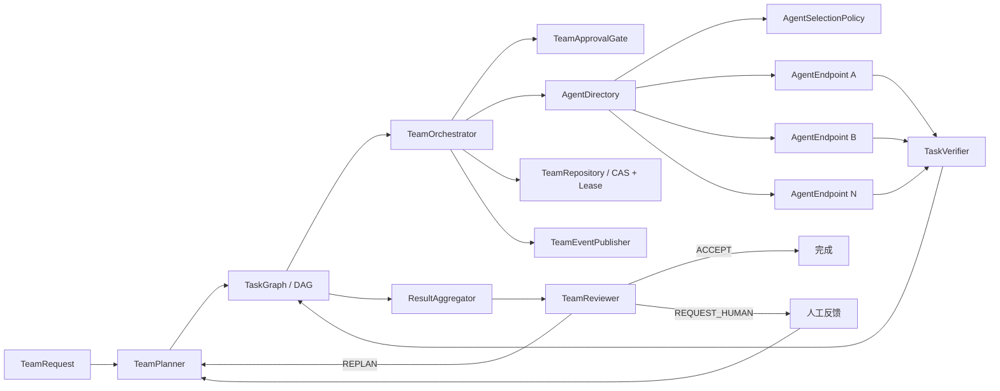

# MatterLoop 架构

MatterLoop 是由 uv workspace 管理的 Loop Engineering 多发行包组件库，支持 Python 3.10–3.14。
12 个发行包都使用 Hatchling 构建，源码直接位于各自的 `src/python/matterloop_xxx` 下，可独立
安装、测试和发布。

## 模块边界

| 层次 | 发行包 | 直接依赖的 MatterLoop 包 |
| --- | --- | --- |
| 独立基础 | `matterloop-core` | 无 |
| 独立基础 | `matterloop-models` | 无 |
| 基础能力 | `matterloop-runtime` | core |
| 基础能力 | `matterloop-tools` | runtime |
| 基础能力 | `matterloop-memory` | core |
| 基础能力 | `matterloop-observability` | core |
| 基础能力 | `matterloop-policies` | core、models、tools |
| Agent | `matterloop-agents` | core、memory、models、tools |
| 组合根 | `matterloop-presets` | agents、core、memory、models、observability、policies、runtime、tools |
| 框架集成 | `matterloop-integration-fastapi` | core、runtime |
| 框架集成 | `matterloop-integration-celery` | core、runtime |
| 框架集成 | `matterloop-integration-redis` | core、runtime |

依赖关系如下，其中箭头表示“依赖”：

```text
runtime ───────────────> core
tools ─────────────────> runtime ──> core
memory ────────────────> core
observability ─────────> core
policies ──────────────> core + models + tools
agents ────────────────> core + memory + models + tools
presets ───────────────> agents + core + memory + models
                         + observability + policies + runtime + tools
integration-fastapi ───> core + runtime + FastAPI/Pydantic
integration-celery ────> core + runtime + Celery
integration-redis ─────> core + runtime + redis-py
```

关键约束：

- core 永远不能导入其他 MatterLoop 发行包。
- models 不依赖 core，可作为独立模型抽象与供应商适配组件使用。
- models 内部固定为 `providers -> base/capabilities/errors`：供应商 SDK 协议、消息转换和
  错误归一化位于 `matterloop_models.providers`，抽象层不能反向导入 providers。
- policies 依赖 models 协议实现 `BudgetedModelClient`；价格和 SDK 客户端仍由组合根注入。
- presets 只负责组件装配，不承载通用业务实现。
- integration 包只负责框架适配、输入校验、鉴权入口和错误映射，不复制 Loop 编排。
- 所有内部版本约束均为 `>=0.1.0,<0.2.0`。

## Core 最小闭环

核心运行链路为：

```text
LoopRequest
  -> Planner 生成有序 Plan
  -> 对 requires_approval=True 的 PlanStep 执行 ApprovalGate
  -> 按步骤指定的 executor 解析并执行 Executor
  -> Verifier 对照步骤或请求验收条件生成结构化结果
  -> 通过后推进下一步骤；失败时携带反馈进入下一 cycle
  -> CheckpointStore 保存可恢复上下文
  -> EventPublisher 发布完整生命周期和审计事件
```

`LoopLimits` 分离三类边界：规划 `cycle`、执行 `attempt` 和单计划 `step` 数量，并可设置活跃
超时。`HumanInteractionRequest/Response/Record` 保存审批、修订和业务输入；人工等待时间不计入
活跃超时。`APPROVE` 后默认 `ResumeMode.CONTINUE` 精确继续，`REVISE/PROVIDE_INPUT`
保留历史并重新规划。

检查点通过 schema v2 的 `LoopCheckpointCodec` 编解码为 JSON，并使用 revision CAS 防止并发反馈或双重
恢复覆盖状态。runtime 可使用公开的
`result_from_context()` 从上下文安全构造结果，不需要访问 Loop 私有状态。

## 注册、发现与热替换

core 使用 `ComponentSpec`、`PluginDefinition` 和 factory 描述插件。组件注册表按稳定名称解析
Planner、Executor 和 Verifier，并支持原子替换。

模型 Agent 保存 `ModelRegistry` 和模型名称，工具 Worker 保存 `ToolRegistry` 和工具名称，因此
替换后的模型或工具会作用于下一次调用。`RuntimeContainer` 先启动新实例，再执行原子替换；旧
调用继续使用旧实例，直到引用释放后再关闭。新实例启动失败时保持旧实例可用。

## 模型抽象、供应商适配、Agent 与工具

`matterloop-models` 的包级公共 API 定义供应商无关的消息、请求、响应、函数调用、continuation、
能力描述、Token 用量 DTO、模型协议、注册表和测试实现。同一发行包内的
`matterloop_models.providers` 在这组稳定抽象之上提供以下可选适配器：

- `OpenAIModelClient` 使用 OpenAI Responses API；
- `DeepSeekChatModelClient` 使用 DeepSeek Chat Completions；
- `MiniMaxChatModelClient` 使用 MiniMax OpenAI-compatible Chat Completions；调用方必须显式
  注入客户端和模型名，适配器不提供默认模型、端点或密钥；
- `QwenChatModelClient` 使用千问 OpenAI-compatible Chat Completions；
- `ZhipuChatModelClient` 使用智谱 GLM Chat Completions；
- `OpenAICompatibleChatModelClient` 接入调用方显式描述能力的其他兼容服务；
- `CallableModelClient` 或直接实现 `ModelClient` 接入任意私有协议。

providers 子包内的 Chat 适配器共享消息、工具、用量、安全错误和私有 continuation 的归一化
内核，但 thinking、JSON、工具选择和供应商业务错误仍由独立薄适配器处理。continuation 绑定
创建它的适配器实例，不能在热替换后跨客户端或租户复用；工具输出必须与待处理 call id 完整对应。
MiniMax 的 `reasoning_details` 只保存在不可打印的私有 continuation 中，不进入日志、事件、检查点
或公开结果；其结构化输出采用 Schema 提示降级并由 Agent 本地严格校验，不假定原生 JSON Schema。

`ModelRegistry.acquire()` 在整个事务内固定客户端。`swap()/retire()` 使用引用计数等待旧租约排空，
让新事务立即看到替换实例，同时由组合根决定何时关闭旧资源。`ModelDescriptor`、
`ModelCapabilities` 和 `ModelRequirements` 支持在装配阶段检查文本、工具、结构化输出、推理与续轮
能力，未知能力不会被误判为明确支持。

SDK 客户端由应用层构造并注入，models 发行包不读取环境变量，也不负责解析或保存密钥、端点和
请求头。Agent、policy 与 preset 的运行时代码只依赖模型协议；具体供应商适配器由应用组合根从
`matterloop_models.providers` 按需导入并注入。

`matterloop-agents` 提供：

- `ModelPlanner`：生成结构化有序计划；
- `ToolCallingWorker`：执行有限轮次的模型工具循环；
- `CriteriaVerifier`：输出分数、证据和失败验收条件；
- `ModelReviewer` 与 `ReviewerVerifierAdapter`：提供独立审查及协议适配。

### 多智能体团队编排

多智能体协作属于 `matterloop-agents` 的 `matterloop_agents.collaboration` 子包，不增加新的
workspace 发行包或依赖方向。当前采用分层协调式架构，并用任务 DAG 支持可验证并行：



职责边界如下：

- `TeamOrchestrator` 是唯一团队状态写入者，Agent 不能直接修改任务图；
- `TaskGraph` 管理依赖、就绪计算、严格转换、重试尝试数和恢复；
- `AgentDirectory` 管理能力发现、并发租约以及原子热替换；
- `LeastBusyScheduler` 先匹配能力，再按负载和稳定 Agent ID 选择；
- `TeamRepository` 通过版本号 CAS 防止状态覆盖，并用运行级独占租约阻止多个控制器重复执行；
- `LoopAgentEndpoint` 通过结构协议适配已有 `AsyncRuntime`，不会让 agents 反向依赖 runtime；
- `InMemoryMailbox` 和 `ArtifactStore` 提供类型化通信出口，但不允许绕过控制器写全局状态。

执行结果会在进入 `VERIFYING` 时先持久化；验证阶段恢复只继续验证或应用已保存的验证结论，不会
重新执行有副作用的 Agent。恢复还会校验任务状态与依赖状态的一致性，拒绝下游任务绕过未完成
依赖。持久化仓储必须实现跨进程租约的续期和崩溃过期语义；内存仓储使用进程内所有者租约。

团队运行在 `TeamLimits.max_cycles/max_plan_revisions` 内执行有界外层循环。规划器接收
`TeamPlanningContext`，其中包含 Agent 能力快照、审查历史和人工反馈；未注册能力在执行前被
拒绝。任务验证失败先消耗任务重试，耗尽后进入下一 cycle。`ModelTeamReviewer` 在汇总后
执行总体验收。`AsyncTeamRuntime/LocalTeamRuntime.submit_human_response()` 用于幂等提交审批、
修订或业务输入。`AsyncTeamRuntime` 是异步门面；
`LocalTeamRuntime` 使用专用事件循环线程提供同步接口。所有规划器、端点、仓储、发布器和运行时
都由应用显式构造并注入，不读取 `.env` 或进程环境。

团队超时仅累计活跃规划、执行、验证和聚合；人工等待不计入。异步取消是协作式的，
自定义组件需要定期进入 `await`，并对网络、工具和子进程设置组件级超时。

`matterloop-tools` 对注册、发现、授权和调用使用统一入口：

- `ShellTool` 只接受 argv，从不使用 `shell=True`；
- `FileSystemTool` 将路径限制在 workspace 内，默认只读；
- `HttpTool` 默认仅允许 HTTPS `GET`、显式 host allowlist、有限响应体和受控重定向。
- `McpServerRegistry` 管理调用方注入的 MCP Session，并提供 tools、resources、resource
  templates 和 prompts 操作；远端工具通过 `McpToolAdapter` 进入原有 `ToolRegistry`，因此继续
  复用授权、额度和 Agent 工具循环；
- `SkillLoader/SkillRegistry` 只安全加载专用根目录下的 `SKILL.md`；`SkillTool` 只执行
  `list/get`，把内容标记为不可信参考数据，不执行 Skill 中的命令。

MCP 保持协议定义的控制边界：tools 可以经本地授权后由模型调用，resources 由应用选择，
prompts 由用户或控制面选择。端点、凭据、transport、OAuth 和 Session 均由宿主构造；连接热替换
只影响新调用，旧调用通过租约完成。已发现的工具 Adapter 绑定目录令牌，连接替换后必须重新发现
并替换 Adapter，避免旧 Schema 调用新服务。MCP 与 Skill 返回内容均可能包含提示注入或敏感数据，
不能绕过 `ToolAuthorizer`、审批、预算和可观测性脱敏策略。

## 记忆、策略与可观测性

长期记忆 `MemoryStore` 与 Loop 检查点 `CheckpointStore` 是两个独立协议。当前 memory 包提供
`NullMemoryStore`、`InMemoryMemoryStore` 和 `InMemoryCheckpointStore`，不提供 PostgreSQL、
pgvector 或其他持久化后端。

policies 包提供预算、无进展停止、指数退避重试、规则审批、规则权限和多 scope 原子
`UsageLedger`。`BudgetedModelClient/Tool/Executor/AgentEndpoint` 在 await 前预留额度，成功按实际
用量结算，失败回滚。`TokenRateCard` 只接受调用方显式传入的价格和生效日期。

observability 包提供结构化日志、脱敏、复合事件发布，以及可选 OpenTelemetry tracing/metrics。
`CompositeEventPublisher` 支持 `RAISE` 与 `LOG_AND_CONTINUE` 两种失败模式；`Redactor` 默认过滤
token、authorization、cookie 和调用方声明的敏感字段。

## Runtime 与生产运行

- `AsyncRuntime` 是标准异步运行门面。
- `LocalRuntime` 使用专用事件循环线程提供同步 `run/resume/cancel`。
- `QueueRuntime` 提供 `submit/get/list/result/wait/cancel/resume/list_events`。
- `QueueBackend` 负责命令队列及 lease，`RunRepository` 负责运行状态和 CAS。
- `LocalProcessSandbox` 仅限制 cwd、环境、超时和输出量，不承诺恶意代码隔离。

production preset 返回组合对象 `ProductionRuntime`：API 或调度器使用其队列方法，队列 worker
使用 `worker_runtime` 执行实际 Loop。构建时必须显式注入：

1. `QueueBackend`：提交、租用、确认和释放队列命令；
2. `RunRepository`：保存运行状态并提供 CAS；
3. `CheckpointStore`：保存 Loop 精确恢复检查点；
4. 审计 `EventPublisher`：发布完整审计事件，失败模式固定为 `RAISE`。

`RunEventReader` 是可选读取接口；如果审计发布器同时实现它，production preset 会自动复用。
上述四个必需依赖都不提供内存回退，也不会隐式启动后台 worker。

## 四类 Preset

| Preset | 装配内容 | 安全边界 |
| --- | --- | --- |
| minimal | 模型、基础 Agent、空工具表、内存检查点 | 不执行文件、命令或网络工具 |
| coding | 只读默认执行器、可写文件与受限 Shell 的高权限执行器 | 高权限步骤强制审批；命令使用白名单 |
| research | 只读文件、HTTPS HTTP 工具、引用验证器 | 显式 host allowlist；禁用重定向；结果必须有 URL 或制品引用 |
| production | 队列客户端、实际 Loop worker、显式审计发布 | 基础设施缺失时快速失败，不回退内存实现 |

每类异步 preset 都有对应 `build_*_local_runtime()`。所有配置使用 frozen dataclass，首版不读取
YAML。

## 框架集成

- FastAPI：`create_router(runtime, auth_dependency, prefix="/loops")`，提供 create、list、查询、
  cancel、resume 和 events/list 路由。
- Celery：`register_tasks(celery_app, runtime_factory_path)`，消息只传 request DTO 与 run id，
  不序列化 Runtime 或组件实例。
- Redis：提供队列、运行仓储和事件发布适配器；Redis 客户端由应用层构造并注入，不提供记忆
  或检查点持久化。

## 配置与依赖注入

MatterLoop 发行包不读取 `.env`、`os.environ` 或其他进程级配置源。应用可以自行选择环境变量、
配置中心、密钥服务或静态配置，并把已经构造好的模型客户端、Redis 客户端、队列后端、仓储和
Publisher 注入对应组件。CI 中的依赖边界检查会拒绝发行包源码直接读取进程环境。

## 测试与发布边界

工作区统一使用 Ruff、mypy、pytest 和 coverage 配置。12 个发行包独立测试，并从 wheel 在干净环境
执行导入验证，防止 workspace 掩盖漏写依赖。默认套件全部离线；`live_deepseek` 只在用户显式
opt-in、通过 `.env.local` 向测试组合根注入密钥和价格时访问真实端点。
