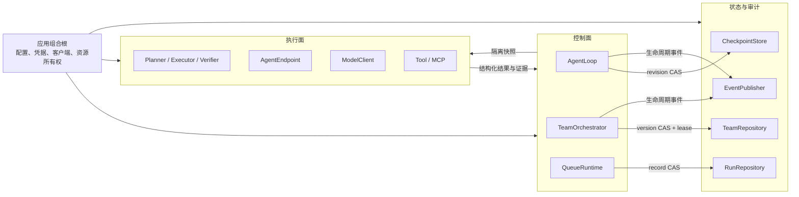
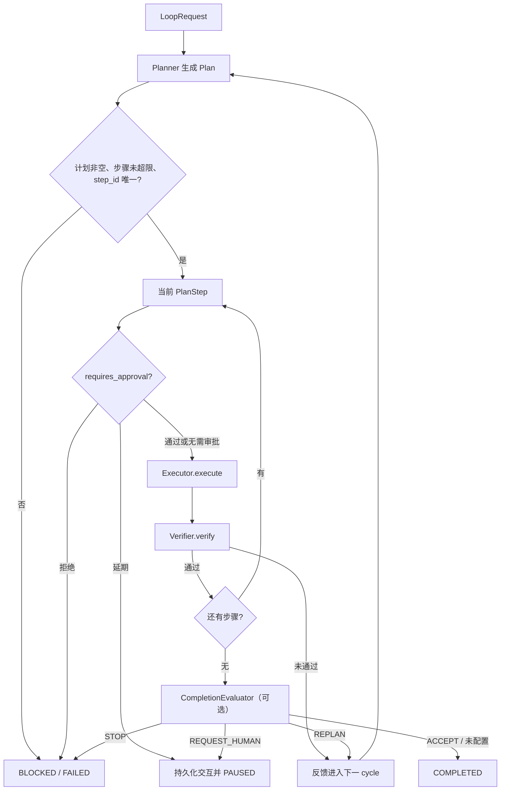

简体中文 | [English](architecture.en.md)

# MatterLoop 架构说明

这不是发行包清单，也不是安装手册。它记录的是维护 MatterLoop 时不能随意破坏的约束：谁能修改
运行状态、一次恢复从哪里继续、并行任务如何汇合，以及外部组件失败后系统应停在哪里。

需要落地装配时看[企业集成指南](enterprise-integration.md)；第一次使用项目时从[根 README](../README.md)
开始。本文描述当前 `0.1.x` 的实现，不替未来版本预先许诺能力。

## 设计取舍

MatterLoop 的核心选择是“确定性控制器 + 不可信能力组件”，而不是让模型自行维护循环状态。

1. **控制器是唯一状态写入者。** Planner、Executor、Verifier、Tool 和 Agent 只接收快照并返回结果；
   它们不能直接推进游标、解锁 DAG 节点或宣布整个目标完成。
2. **恢复语义优先于吞吐。** 会影响恢复位置的结果先持久化，再解锁下游工作。额外一次状态写入是
   有意承担的成本。
3. **协议稳定，基础设施由宿主决定。** SDK 客户端、密钥、价格、数据库、队列和审计发布器都在
   应用组合根创建。发行包源码不读取 `.env` 或进程环境。
4. **所有循环都有硬边界。** 规划轮次、执行尝试、任务数、并发数、活跃时间和计算额度分别计数，
   不能用某一类限制代替另一类。
5. **并行只发生在明确的汇合点之间。** TeamLoop 可以并行调用多个 Agent，但状态应用、验证结论和
   下游解锁仍由控制器顺序提交。

这些选择让系统容易审计和恢复，代价是 MatterLoop 不追求无中心的 Agent 群体，也不隐藏分布式
系统本来就存在的租约、CAS、幂等和消息投递问题。

## 系统切面



控制面决定“下一步是什么”，执行面负责“把这一步做出来”。两者之间传递 dataclass 和 Protocol，
不传数据库会话、队列连接或供应商 SDK 对象。`LoopContext.snapshot()` 与不可变 DTO 用于隔离调用边界；
`metadata` 只是透传数据，不会自动脱敏，也不应被当作任意对象容器。

`AsyncRuntime` 是嵌入式异步入口，`LocalRuntime` 只是在专用事件循环线程上提供阻塞门面。
`QueueRuntime` 属于控制面入口：它创建 `RunRecord`、发送命令并提供查询，不执行 Loop。实际 Worker
调用 worker runtime，并以 CAS 更新 `RunRepository`。拉取式 `QueueBackend` Worker 还要租用并确认
或释放命令；Celery 这类推送式 Worker 则在任务入口通过仓储 CAS 认领运行，二者不能混作同一种队列。

## 单 Agent 闭环

`AgentLoop` 编排一条有序计划。成功不是 Executor 的布尔返回值，而是“执行结果通过独立验证，且
整个目标通过最终验收”。



### 三个计数不能混用

| 边界 | 何时增加 | 耗尽后的结果 |
| --- | --- | --- |
| `cycle_count` | 每次调用 Planner 生成一版计划前 | `BLOCKED / CYCLE_LIMIT` |
| `total_attempts` | 每次调用 Executor 前，包括异常重试 | `BLOCKED / ATTEMPT_LIMIT` |
| `max_steps_per_plan` | 不累计；校验 Planner 当次返回的计划长度 | `BLOCKED / STEP_LIMIT` |

`completed_steps` 是通过或未通过验证后形成的执行记录数，不是预算；验证失败的步骤也已执行并留下
`IterationRecord`。`RetryPolicy` 当前只处理 Executor 抛出的异常。Planner、Verifier、
CompletionEvaluator 或事件发布器的未处理异常会走组件失败路径，不应在文档或上层代码中假定它们
会被 Core 自动重试。

### 状态与停止原因是两件事

`LoopStatus` 表示当前可执行状态，`StopReason` 解释为什么停下。调用方应该同时保存和展示两者。

- `PAUSED` 表示存在外部决策点，通常伴随 `pending_interaction`。
- `BLOCKED` 不是终态；策略拒绝、预算耗尽、审批拒绝或边界耗尽都可能进入该状态。是否恢复必须由
  业务明确决定，不能看到 `BLOCKED` 就自动重试。
- `COMPLETED`、`FAILED`、`CANCELLED`、`TIMED_OUT` 是终态。
- 取消在安全边界检查，是协作式取消。自定义异步组件仍需设置自己的网络或子进程超时，并允许
  `CancelledError` 传播。

`timeout_seconds` 统计活跃执行时间。进入人工等待前，控制器把当前活跃区间结算到
`active_elapsed_seconds`；再次恢复才重新开始计时。暂停不会重置 Core 的 cycle 或 attempt。计算额度
是否跨进程保留取决于账本实现；当前 `UsageLedger` 不随 checkpoint 持久化。

## 检查点、事件与 CAS

一次 Core 状态提交按固定顺序发生：

1. 控制器更新自己的 `LoopContext`；
2. 为即将发布的事件分配单调递增的 `event_sequence`；
3. 调用 `CheckpointStore.save(..., expected_revision=current_revision)`；
4. 保存成功并取得更大的 revision 后，按 sequence 发布事件。

因此，事件消费者看到某个事件时，对应状态已经写入检查点。反过来不成立：检查点保存成功后，
Publisher 仍可能失败。Core 没有把任意数据库和消息系统组合成一个事务，也没有内置 outbox。需要
无缺口审计的部署，必须在宿主侧检测并补偿 sequence 缺口，或扩展成能够原子写状态与 outbox 的
统一持久化边界；只替换 Publisher 做不到这一点，也不能仅凭 `event_sequence` 宣称事件“恰好一次”。

`LoopCheckpointCodec` 当前只接受 schema v2。持久化实现至少要保留当前计划、步骤游标、已批准的
`step_id`、人工交互历史、事件序号、revision 和活跃时间。未知 schema 必须失败，不能猜测字段含义。

CAS 解决的是“两个写入者不能静默互相覆盖”，不是持有整个运行期间的执行租约。Core 会在调用
Planner、Executor 等组件前先保存状态，所以遵守协议的竞争控制器通常会在下一次外部调用前遇到
`CheckpointConflictError`。但外部副作用可能已经发生，而结果检查点尚未写入；当前 Core 也只允许
从 `PAUSED` 或 `BLOCKED` 恢复，不会自动接管崩溃在活跃状态的运行。队列 Worker 仍需在外层认领
`RunRecord`，有副作用的 Executor 仍需使用业务幂等键。

生命周期事件携带 `LoopContext` 快照；Team 事件也可能携带完整 `TeamSnapshot`。其中可能包含提示词、
人工输入、工具输出和业务 metadata。`Redactor` 只能按映射键脱敏，不能保证清洗自由文本。导出到
日志或第三方追踪系统前，宿主必须做数据分级和裁剪。

## 人工反馈不是一个布尔审批框

人工交互被拆成两个 API：先 `submit_human_response()` 持久化决定，再显式 `resume()` 继续。这个分离
允许 HTTP、消息队列或工单系统在进程重启后安全重试提交，也避免“响应已落库但自动恢复失败”变成
一个无法判断的组合操作。

| 动作 | Core 行为 |
| --- | --- |
| `APPROVE` | 记录本步骤的 `step_id`；`CONTINUE` 从当前游标执行，审批门不会再次询问 |
| `REJECT` | 清除待处理交互并进入 `BLOCKED / HUMAN_REJECTED`；继续运行必须显式 `REPLAN` |
| `REVISE` | 要求非空意见，保存历史并标记重新规划 |
| `PROVIDE_INPUT` | 要求非空输入，保存历史并标记重新规划 |

相同 `idempotency_key` 和相同行为字段是 no-op；复用幂等键却改变内容会抛
`HumanResponseConflictError`。`interaction_id` 必须等于当前待处理请求。响应保存仍使用 revision CAS，
所以两个审批人同时提交时不会出现“最后写入者获胜”的静默覆盖。

TeamLoop 复用相同的交互值对象和“提交后再恢复”原则，但版本保存在 `TeamSnapshot.version`。团队任务
审批、整体草稿复核和修改意见由 TeamOrchestrator 解释，不能用 Core 的步骤游标直接推断团队恢复点。

## 为什么 TeamLoop 采用中心监督者 + DAG

Peer-to-peer Agent 聊天容易开始，却很难回答三个生产问题：谁能解锁下游任务、崩溃后哪些副作用
已经发生、两个 Agent 同时修改全局状态时谁获胜。MatterLoop 因此选择中心监督者：Agent 可以并行，
但 `TeamOrchestrator` 是唯一快照写入者。

一轮团队执行遵守以下顺序：

1. `TeamPlanner` 看到当次 `AgentDirectory` 能力快照、历史审查和人工反馈，返回 `TaskSpec`；
2. `TaskGraph` 拒绝空图、重复 ID、缺失依赖和环，控制器再拒绝未注册 capability；
3. 仅依赖已成功的节点进入 `READY`，按优先级和稳定任务 ID 调度；
4. `AgentDirectory` 同时检查能力与 `AgentSpec.max_concurrency`，租约固定本次调用的 Endpoint；
5. 控制器先保存 `RUNNING` 状态，再并行调用本批 Agent；
6. 成功的执行结果先保存为 `VERIFYING`，然后调用独立 `TaskVerifier`；
7. 验证通过后才标记 `SUCCEEDED` 并解锁下游；失败先消耗任务级尝试，耗尽后触发团队重规划；
8. 全部节点成功后聚合草稿，再由 `TeamReviewer` 决定 `ACCEPT`、`REPLAN`、`REQUEST_HUMAN` 或
   `STOP`。

第 6 步是恢复边界：崩溃后，`VERIFYING` 节点保留执行结果并继续验证，不重放 Agent；停在 `RUNNING`
的节点没有可证明完成的结果，会恢复为 `READY`，因此可能再次执行。AgentEndpoint 和它调用的外部
系统必须使用稳定的业务幂等键保证副作用只发生一次。`attempt` 适合审计，不适合单独参与“只执行
一次”的幂等键，因为恢复重试会增加它。

`dependency_results` 是下游 Agent 接收上游结果的正式通道。Mailbox 和 ArtifactStore 是可选的通信
与制品出口，不具备修改任务图的权限。`LoopAgentEndpoint` 用结构化 `LoopRuntime` Protocol 包装已有
单 Agent Runtime，避免 `matterloop-agents` 反向依赖 `matterloop-runtime`。

TeamRepository 同时提供 snapshot version CAS 和运行级 lease。内存实现只保护单进程；生产实现要
处理进程崩溃后的租约过期。当前协议没有续租方法，长任务部署必须把租约期限、Worker 最大执行时间
和基础设施可见性超时一起设计，不能假设 Orchestrator 会自动续租。

## 失败、重试与计算额度

失败路径按“是否值得再次执行”分类：

| 情况 | Core | TeamLoop |
| --- | --- | --- |
| Executor/任务组件的普通异常 | Executor 异常交给 `RetryPolicy` | 任务级重试，耗尽后重规划 |
| 验证不通过 | 保存证据并重新规划 | 保存验证结论，任务重试后可进入下一 cycle |
| `ResourceLimitExceededError` | `BLOCKED / BUDGET_EXHAUSTED`，不重试 | `BLOCKED / BUDGET_EXHAUSTED`，不重试 |
| 未分类组件错误 | 保存 `FAILED / COMPONENT_ERROR` 后向调用方抛出 | 保存失败结果并由 Team Runtime 返回 |
| CAS 冲突 | 不覆盖胜者，向调用方暴露冲突 | 最新快照已终止则返回，否则向调用方暴露冲突 |

`LoopLimits` 和 `TeamLimits` 约束控制流；`BudgetLimits` 约束实际资源，两者需要同时配置。
`UsageLedger.reserve()` 在进入异步模型、工具或 Agent 调用前，对所有 scope 一次性预留最坏用量；
成功按供应商实际 usage `commit()`，失败 `rollback()`。任一父或子 scope 超限，整个预留都不落账，
从而避免同一进程中的并行调用超卖。

如果供应商报告的实际用量大于预留，账本先记录已经发生的消耗，再抛额度异常阻止后续工作。费用用
micro-unit 整数记录，`TokenRateCard` 由应用显式注入，库中没有供应商价格。

当前 `UsageLedger` 是进程内、线程安全账本，不是分布式额度服务，也不随检查点自动持久化。多个
Worker 共享一个企业额度时，需要在包装器之外提供集中式原子预留，或者把额度静态切分给 Worker；
不能把每个进程各自的相同上限相加后仍称为全局硬限制。

## 热替换的保证并不完全相同

“注册表支持 replace”只说明新查询能原子看到新对象，不必然包含启动、排空和关闭。维护者应根据
组件类型选择正确入口。

| 入口 | 已开始调用 | 新调用 | 生命周期所有者 |
| --- | --- | --- | --- |
| Core `ComponentRegistry` | Python 引用仍指向旧实例；无排空协议 | 立即看到新实例 | 调用方 |
| `ModelRegistry.swap()` | `ModelLease` 固定完整模型事务 | 立即看到新客户端 | 调用方等待 `ModelRetirement.wait_drained()` 后关闭 |
| `RuntimeContainer` / `ToolRegistry` | `acquire()` 租约覆盖授权与执行 | 新实例 `start()` 成功后才可见 | 容器在旧租约排空后调用 `aclose()` |
| `AgentDirectory` | `AgentLease` 固定 Endpoint，容量计数保留 | 使用新 Endpoint 和新发现信息 | 调用方；目录不启动或关闭 Endpoint |
| `McpServerRegistry` | 旧连接租约完成后关闭受托管 Session | 使用新连接和新 catalog | 由连接的所有权配置决定 |

模型的 continuation 只能在创建它的适配器和同一次租约中续传；内置 Agent 不把它写入事件或检查点。
MCP Tool Adapter 绑定发现时的 catalog token；连接替换后要重新发现并替换 Adapter，不能拿旧 Schema
调用新服务。这些限制是为了防止热替换跨越供应商、租户或工具版本边界。

## 发行包依赖边界

依赖方向由 [`scripts/check_dependencies.py`](../scripts/check_dependencies.py) 静态检查。新增依赖不能只改
`pyproject.toml`，还要先证明没有把具体基础设施拉进内层协议。准确白名单是：

| 包 | 允许直接依赖的 MatterLoop 包 | 原因 |
| --- | --- | --- |
| core、models | 无 | 分别保存编排端口和模型端口，不能知道实现层 |
| runtime | core | 为 AgentLoop 提供运行门面和队列 DTO |
| tools | runtime | 复用组件生命周期与 Sandbox 端口 |
| memory、observability | core | 实现 Core 的存储或事件端口 |
| policies | core、models、tools | 包装 Loop、模型和工具调用 |
| agents | core、models、tools、memory | 实现单 Agent 与 TeamLoop；用结构协议接入 Runtime |
| presets | 八个基础包 | 唯一负责默认装配的发行包 |
| integration-fastapi/celery/redis | core、runtime | 只做传输、DTO、仓储或队列适配 |

供应商适配位于 `matterloop_models.providers`，但 models 仍是一个独立基础包：抽象层不能反向导入
providers。集成包不能复制 Loop 编排，preset 不能成为业务逻辑收容所。

## 扩展代码应该放在哪里

判断标准不是“这个功能叫什么”，而是“它掌握哪一种状态”：

- 新 Planner、Executor、Verifier、ApprovalGate 或 CompletionEvaluator 实现 Core Protocol；只有通用
  状态语义才进入 core。
- 新模型供应商实现 `ModelClient`，或在 `matterloop_models.providers` 增加薄适配。适配器接收已构造
  SDK 客户端，归一化 capability、usage 和安全异常；不得读取密钥，也不得把 reasoning continuation
  放进公开结果。
- 新工具实现 `Tool` 并通过 `ToolRegistry.invoke()` 调用。授权器看到的参数快照必须与实际执行参数
  等值，避免授权后被调用方篡改。
- MCP 的 transport、OAuth 和 Session 由宿主创建；远端 tool 经 `McpToolAdapter` 进入 ToolRegistry，
  resource 和 prompt 由控制面显式读取，不自动暴露给模型。
- Skill 是不可信 Markdown 参考数据。`SkillLoader` 只在专用根目录读取 `SKILL.md`，`SkillTool` 只提供
  `list/get`，不会执行文档里的命令。需要执行能力时应写成经过 Schema、授权和预算控制的 Tool。
- 新 CheckpointStore 必须实现 revision CAS 和快照隔离；新 TeamRepository 还必须实现 version CAS、
  运行租约及崩溃过期。持久化格式升级要显式增加 schema 版本和迁移策略。
- 新框架集成只转换请求、鉴权、映射错误和调用 runtime。只要集成层开始选择 Executor 或修改 DAG，
  编排边界就已经被破坏。

插件发现通过 `FactoryCatalog` 和 Python Entry Point 显式触发。普通 `import` 不扫描或执行第三方插件；
这是供应链边界，不应为了“开箱即用”改成隐式自动发现。

## 明确不做的事

当前代码没有提供，也不应在文档中暗示已经提供以下保证：

- 不提供 CLI、管理后台、部署脚本或配置中心；
- 不内置 PostgreSQL、向量数据库或生产级 CheckpointStore；内存实现只用于测试和单进程开发；
- `LocalProcessSandbox` 只限制 cwd、环境、超时和输出，不隔离恶意代码；
- 不保证外部副作用、队列投递和事件发布恰好一次；
- 不自动读取环境变量、创建供应商客户端、选择模型或加载价格；
- 不提供跨进程 UsageLedger，也不查询供应商账户余额；
- 不允许 Agent 通过 Mailbox、MCP resource 或 Skill 绕过控制器修改全局状态；
- Redis 集成不等于 CheckpointStore，Celery Producer 也不等于拉取式 QueueBackend；
- 当前 FastAPI 集成没有完整的 HTTP HITL 提交面，Python API 的能力不能直接等同为 HTTP API 能力。

## 修改架构前的检查

一次改动如果触碰下面任一问题，应先补测试和本文中的决策说明：

- 新状态能否从状态机中的当前状态合法到达，恢复时从哪个游标继续？
- 外部调用前后各保存了什么，崩溃会不会重放有副作用的工作？
- CAS 冲突、租约过期和幂等重试分别由谁处理？
- 额度是在 `await` 前预留，还是调用完成后才发现超支？
- 热替换时旧调用由谁排空，旧资源由谁关闭？
- 事件是否包含原始提示词、人工输入、工具结果或供应商私有状态？
- 新 import 是否仍符合依赖白名单，构建后的 wheel 是否声明了真实依赖？

架构边界的自动检查入口是：

```bash
uv run python scripts/check_dependencies.py
uv run ruff check
uv run mypy
uv run pytest
```
