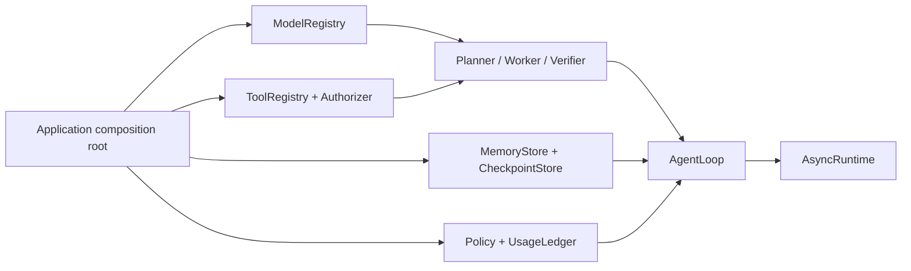
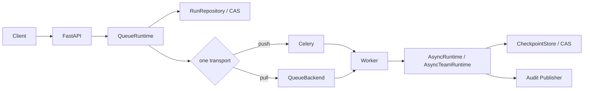

[简体中文](enterprise-integration.md) | English

# Enterprise Integration Guide

This guide is for engineering teams responsible for the composition root, Workers, and runtime infrastructure. It
does not repeat every class field. Instead, it explains the decisions required to operate a MatterLoop system and the
contracts those decisions must preserve.

To understand how the Loop works, start with the [Architecture Guide](architecture.en.md). Executable assembly
examples are under [`examples/enterprise`](../examples/enterprise/README.en.md), and the README for each distribution
documents its concrete constructor parameters.

## Make three decisions first

### Where execution happens

| Form | Entry point | Appropriate for | Cost |
| --- | --- | --- | --- |
| Embedded asynchronous | `AsyncRuntime` | Existing asynchronous services, background jobs, tests | Active runs are interrupted when the process exits unless the business supplies takeover behavior |
| Embedded synchronous | `LocalRuntime` | Scripts, notebooks, synchronous systems | Maintains a dedicated event-loop thread; must not be placed in an asynchronous request path |
| Multi-Agent | `AsyncTeamRuntime` | Work that can be expressed as a DAG and requires capability routing and team acceptance | Requires TeamRepository, controller leases, and idempotent Endpoints |
| Queued execution | `QueueRuntime` + Worker | Separating APIs from long-running work and scaling across processes | Requires message leases, RunRepository CAS, persistent checkpoints, and failure recovery |

Do not introduce TeamLoop for a simple task merely to make it “multi-Agent.” Work that can finish reliably in one
process also does not need a queue by default. Failure recovery and throughput requirements should determine the
topology, not the number of components.

### Who owns the queued message

Celery and a pull-based QueueBackend are alternatives, not two queue layers:

- In an existing Celery deployment, `CeleryQueueProducer` sends JSON DTOs and the Celery Worker owns the Broker
  message.
- For a custom Worker, use `RedisQueueBackend` or a custom `QueueBackend` that implements
  `lease/acknowledge/release`.
- Celery may be combined with `RedisRunRepository` and `RedisEventPublisher`, but Redis QueueBackend must not also
  consume the same run.

### Which store answers which question

| Data | Interface | Question it answers | It cannot replace |
| --- | --- | --- | --- |
| Loop checkpoint | `CheckpointStore` | Which plan step has been reached, and how can execution resume exactly? | RunRepository, long-term memory |
| Control-plane run record | `RunRepository` | What is the current run state, and how does the API query it? | checkpoint |
| Team state | `TeamRepository` | What are the DAG, task results, cycle, and controller that owns the run? | Core checkpoint |
| Long-term memory | `MemoryStore` | Which historical information may an Agent retrieve? | Any state-machine store |
| Audit event | `EventPublisher` / `TeamEventPublisher` | Why did state change, and what is the event order? | Authoritative state storage |

These interfaces may use the same database, but they need separate schemas, permissions, retention periods, and
transaction semantics. The Redis integration provides single-key revision CAS through `RedisCheckpointStore`; a host
using another database must inject an equivalent persistent implementation.

## Two standard deployment topologies

### Embedded service



At application startup, create external clients, then adapters, registries, Agents, the Loop, and the Runtime.
Requests submit only a `LoopRequest`. Do not recreate SDK connection pools or a `LocalRuntime` thread for every
request.

### API and Worker separation



`QueueRuntime` is a control-plane component and does not start a Worker. A pull-based Worker should always follow this
basic order:

1. Acquire a message lease.
2. Claim the run through RunRepository CAS.
3. Execute or resume the Runtime.
4. Write the result back with CAS.
5. Acknowledge success; release a retryable failure with backoff.

Possessing a message does not grant state-write ownership, and a successful CAS cannot undo a tool side effect that
already happened. Both mechanisms are therefore required.

## The composition root owns configuration and credentials

Distributions do not read `.env`, a configuration service, or the process environment. The recommended startup order
is:

1. Load and validate configuration from the configuration and secret services.
2. Create model SDKs, Redis/Celery and database clients, HTTP transports, and the OTel provider.
3. Construct Providers, MCP Session adapters, Stores, Publishers, and Policies from those clients.
4. Register models, tools, and Agents, then create the Runtime last.
5. Start accepting traffic only after health checks pass.

Close resources in reverse order: stop new traffic and submissions, drain Workers and invocation leases, close the
Runtime and registries, then close application-owned connection pools and telemetry exporters.

| Object | Default owner | Notes |
| --- | --- | --- |
| Provider SDK client | Application | A Provider closes it only when `owns_client=True` |
| Clients in `ModelRegistry` | Application | `swap/retire` supports draining but does not close resources for you |
| Tool | `ToolRegistry` | Registration, replacement, unregistration, and shutdown manage the Tool lifecycle |
| Runtime `resources` | Runtime | Closes only the objects explicitly supplied at construction |
| Redis/Celery/database client | Application | Integration adapters do not take ownership of a shared connection pool |
| Per-task Celery Worker dependencies | Closer returned by the Worker factory | Closed at the end of every task |

For a hot swap, start the new instance first, switch traffic, drain old leases, and then close the old instance. Do
not interpret “closing the old instance failed” as “the replacement did not happen”; query the current registry state
first.

## Identity, tenancy, and data boundaries

Authentication proves who the caller is. Authorization must additionally answer whether that caller may access a
particular run, tool, or resource. Derive `tenant_id` and usage scopes from a trusted Principal, and repeat the check
at these boundaries:

- FastAPI create/get/list/cancel/resume/events operations;
- every argument-level ToolAuthorizer decision;
- Memory, checkpoint, RunRepository, and TeamRepository namespaces;
- MCP resource, prompt, and tool operations;
- ownership of the interaction and run for a human response.

`run_id`, `namespace`, and metadata are not authorization credentials. Do not let a client choose an arbitrary tenant
namespace, and do not encode an email address, order body, or access token in a run ID.

Model messages, tool output, human feedback, events, and checkpoints may contain business secrets. API keys, Cookies,
Authorization values, and database credentials must never enter these structures. A Provider continuation is hidden
from repr but must still stay within its current model transaction and must not be persisted.

## Threat model for tools and external content

| Entry point | Existing defenses | Deployment responsibilities that remain |
| --- | --- | --- |
| `ToolRegistry` | Invocation lease, argument snapshot, Authorizer interface | Default Authorizer permits everything; identity, tenant, and argument policy are required |
| `FileSystemTool` | root, path resolution, symbolic-link checks, size limits | Same-host TOCTOU, hard links, permission principal, disk quota |
| `ShellTool` | argv, executable allowlist, empty environment, timeout and output limits | Argument semantics, network/system calls, process tree, malicious-code isolation |
| `HttpTool` | HTTPS, host/method allowlists, redirect validation on every hop | DNS rebinding, private-network CIDRs, ports, egress, TLS identity |
| MCP | Session injection, capability negotiation, pagination/content boundaries, catalog token | Transport body limit, OAuth, remote trust, sampling/elicitation |
| Skills | Read-only access, allowlist, path/inode/size checks | Source review, read-only mount, version release, prompt-injection governance |

Treat content from a web page, file, MCP resource, Prompt, or Skill as untrusted reference material. It cannot change
system permissions, approval rules, or budgets. `LocalProcessSandbox` is not a malicious-code security boundary; use
a container, virtual machine, or remote Sandbox for high-risk execution.

## Concurrency and idempotency

| Boundary | Contention key | Correct handling |
| --- | --- | --- |
| Core resume/human response | `run_id + revision` | Reread after CAS failure; do not overwrite the latest checkpoint |
| Queue state | `run_id + version` | A Worker commits only the version it claimed |
| Team controller | `run_id + version + owner lease` | An active lease rejects a second controller; side effects use fencing/idempotency keys |
| Human feedback | `interaction_id + idempotency_key` | Same key and content is a no-op; same key with different content is a conflict |
| Model/tool hot swap | registry name + invocation lease | An old transaction pins the old instance; a new transaction uses the new instance |
| Celery redelivery | deterministic task id + RunRecord CAS | Task ID is diagnostic; CAS is the execution-claim authority |

Every external side effect should use a stable business idempotency key composed from run/task/step identifiers.
`attempt` is for auditing. Do not include it in the deduplication key unless every attempt is intentionally supposed to
create a distinct side effect. Database-state CAS prevents an old result from overwriting newer state, but it cannot
recall an email, payment, or network request that was already sent.

The current Redis Queue, Celery run-claim path, and TeamRepository protocol do not provide a general
heartbeat/renewal mechanism. A lease must cover the worst-case end-to-end execution time and clock drift. Very long
tasks require lease renewal or decomposition.

## Budgets must take effect before a call

`UsageLedger` uses reserve/commit/rollback to stop concurrent calls from jointly exceeding a budget. Configure
organization, tenant, run, task, and Agent scopes together:

```text
organization:acme
tenant:tenant-42
team:team-run-id
task:task-id
agent:agent-id
```

Wrap `BudgetedModelClient`, `BudgetedTool`, `BudgetedExecutor`, and `BudgetedAgentEndpoint` before registering their
components. Cost calculation requires an application-provided `TokenRateCard` with currency and effective date.
MatterLoop neither embeds prices nor queries provider billing.

`UsageLedger` is an in-process atomic ledger. When several Workers share a hard budget, provide a centralized atomic
reservation service outside these wrappers or partition the budget statically among Workers. The current packages do
not implement a distributed ledger, and the production preset does not add one.

## Audit is not ordinary logging

Core first saves a checkpoint with CAS, then publishes an event with a contiguous sequence. The event therefore
refers to state that exists, but the operations are not one transaction across systems: the Publisher may fail after
the checkpoint succeeds. Lossless audit requires the host to add a unified state-and-Outbox persistence boundary or
detect and compensate for sequence gaps. Replacing only the Publisher is insufficient.

`LOG_AND_CONTINUE` is appropriate for disposable telemetry; compliance audit usually selects `RAISE`. Redactor
filters sensitive fields by mapping key only. It does not scan free text, model output, or exception tracebacks. Logs
should usually retain only run/task/step identifiers, tenant, revision/version, state, stop reason, and usage counts.

The application configures OpenTelemetry Providers, Exporters, sampling, and resource attributes. Team events carry a
complete Snapshot; evaluate their size, cardinality, and sensitive fields before writing them to a SIEM or Trace.

## Failure drills

Do not test only the successful path before launch. At minimum, verify:

| Failure | Expected result |
| --- | --- |
| Worker crashes after a tool side effect but before state commit | Core retains a reconciliation point under `active_operation_id` and enters `RECOVERY_REQUIRED` without blind replay; after reconciling a saved result it continues from `VERIFYING` |
| Two requests submit human feedback concurrently | One revision CAS succeeds; the other receives an idempotent no-op or a conflict |
| A long call remains active during a model/tool hot swap | Old call finishes, new call uses the new instance, and the old resource then closes |
| Audit backend is unavailable | Progress is blocked or an explicit alert is raised according to policy; loss is not silent |
| Lease expires before the task finishes | Fencing/idempotency prevents duplicate side effects, or the test fails explicitly and exposes the configuration error |
| Any parent or child scope budget is exhausted | A hard-limit error is raised before invocation and does not enter a pointless retry |
| Checkpoint/event payload is corrupt or has an unknown version | It is rejected strictly rather than advanced using best-effort parsing |

## Current gaps

- The FastAPI integration has no route for submitting `HumanResponse` and does not return a pending interaction. A
  complete HTTP HITL flow requires an authenticated application endpoint.
- The Redis integration provides no long-term memory, Worker, lease renewal, TTL, or cleanup API; checkpoints guarantee only single-key revision CAS.
- Celery run claims do not renew; `claim lease` must exceed the longest normal task duration.
- In-memory Stores, Queues, Repositories, UsageLedger, and TeamRepository are suitable only for tests or
  single-process execution.
- The production preset returns a control plane and worker runtime but does not start a consumer loop or deploy a
  process.
- The local Sandbox does not isolate malicious code.

## Production-readiness checklist

- [ ] Every external I/O has a timeout, bounded retries, and cancellation propagation.
- [ ] Checkpoint, RunRepository, and TeamRepository CAS has been tested concurrently against the real backend.
- [ ] Queue lease, claim lease, Runtime timeout, and Broker visibility timeout have been calibrated together.
- [ ] Tools, Endpoints, and business side effects use stable idempotency keys.
- [ ] Model, Token, cost, tool, attempt, and Agent-task hard limits have parent and child scopes.
- [ ] Identity is bound to runs, namespaces, MCP resources, and human interactions, not merely authenticated once.
- [ ] Event failure policy, Outbox/compensation, redaction, encryption, retention, and deletion have been reviewed.
- [ ] Shutdown stops new traffic, drains leases, and closes application-owned connection pools.
- [ ] Offline tests, Ruff, mypy, dependency boundaries, wheel/sdist builds, and clean-environment imports all pass.
