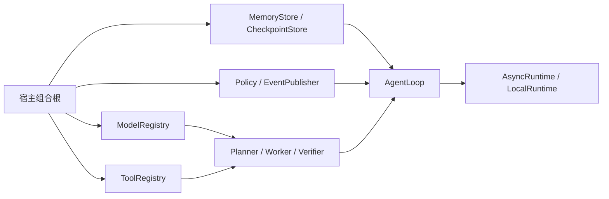
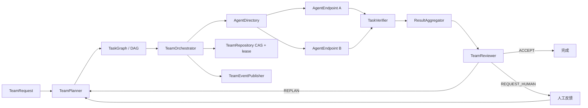
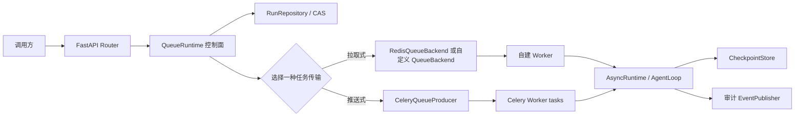

# MatterLoop 企业集成指南

本文说明 MatterLoop 各发行包在企业应用中的装配边界、运行拓扑、资源所有权和数据治理要求。
各类型的逐字段说明位于对应发行包 README；本文只描述跨模块契约，不复制字段表。

## 1. 先选择组合根

MatterLoop 不读取 `.env`、进程环境或配置中心。宿主应用是唯一组合根，负责读取配置、创建
SDK 客户端和基础设施连接，并把已经构造好的对象注入组件。推荐按运行形态选择入口：

| 运行形态 | 入口 | 适用场景 | 不适合 |
| --- | --- | --- | --- |
| 嵌入式异步 | `AsyncRuntime` | FastAPI 后台任务、异步服务、测试 | 需要跨进程排队的任务 |
| 嵌入式同步 | `LocalRuntime` | 脚本、Notebook、同步业务系统 | 在已有事件循环线程中阻塞调用 |
| 多智能体 | `AsyncTeamRuntime` / `LocalTeamRuntime` | DAG 并行、能力路由、团队审查 | 单步骤或无需协作的简单任务 |
| 拉取式队列 | `QueueRuntime` + `QueueBackend` | 自建 Worker、Redis 队列 | Celery 已负责消费和消息租约的系统 |
| 推送式队列 | `QueueRuntime` + `CeleryQueueProducer` | 已有 Celery Broker/Worker | 需要调用 `lease/acknowledge/release` 的 Worker |

底层依赖方向固定为：

```text
runtime       -> core
tools         -> runtime -> core
memory        -> core
observability -> core
policies      -> core + models + tools
agents        -> core + memory + models + tools
presets       -> agents + core + memory + models + observability + policies + runtime + tools
integration-* -> core + runtime + 对应第三方框架
```

`matterloop-core` 和 `matterloop-models` 是独立基础包。Core 只定义编排协议，不知道模型、工具、
数据库或 Web 框架；models 只定义供应商无关 DTO、能力和模型事务。

## 2. 三种标准拓扑

### 2.1 嵌入式单 Agent



调用顺序为计划、按步骤审批、执行、独立验证和整体完成判断。`cycle` 只在重新规划时增加，
`attempt` 在每次 Executor 调用时增加，单计划步骤数由 `max_steps_per_plan` 单独限制。人工等待
不计入 active timeout；预算账本和累计计数不会因为暂停恢复而清零。

组合根必须完成以下工作：

1. 创建供应商 SDK 客户端，并用 provider 适配器或自定义 `ModelClient` 包装。
2. 把模型注册到 `ModelRegistry`；Agent 只保存模型名，调用时获取事务租约。
3. 创建 Tool、权限策略和 `ToolRegistry`；危险工具不能依赖模型自行约束。
4. 分别创建 `MemoryStore` 与 `CheckpointStore`，不能用长期记忆代替运行检查点。
5. 组装 Policy、审批门、重试策略和审计 Publisher，再创建 `AgentLoop` 与 Runtime。
6. 在应用 shutdown/lifespan 中关闭 Runtime、工具、模型 SDK 和外部连接。

### 2.2 TeamLoop 多智能体



`TeamOrchestrator` 是唯一团队状态写入者。Agent 只能返回 `TaskResult`，不能直接修改 DAG、
其他任务或 `TeamSnapshot`。依赖任务的结果通过 `AgentTaskContext.dependency_results` 传递；
Mailbox 和 ArtifactStore 是可选通信出口，不能绕过控制器写全局状态。

生产 `TeamRepository` 必须提供跨进程 CAS 和运行级独占租约。任务结果进入 `VERIFYING` 前会先
持久化，因此恢复验证阶段不会重新执行已经产生副作用的 Agent。内存仓储、Mailbox 和
ArtifactStore 只适合测试与单进程开发。

### 2.3 队列生产拓扑



Celery 与 Redis QueueBackend 不能同时作为同一次运行的任务传输：

- `RedisQueueBackend` 实现主动拉取所需的 `lease/acknowledge/release`。
- `CeleryQueueProducer` 只负责发送 DTO，Broker 与 Celery Worker 持有消息租约。
- `CeleryQueueBackend` 是兼容名称，仍然只是 `QueueProducer`，不能传给要求完整
  `QueueBackend` 的 Worker。
- Celery 场景仍可使用 `RedisRunRepository` 保存查询状态，使用 `RedisEventPublisher` 保存事件。
- Redis 集成不提供 CheckpointStore。多进程恢复必须另外实现 Core `CheckpointStore`，并支持
  schema v2 与 revision CAS。

`QueueRuntime` 是控制面，不会消费任务或启动后台 Worker。拉取式 Worker 必须自行租用命令、
执行 `worker_runtime`、CAS 更新 `RunRepository`，然后 acknowledge；失败时按退避策略 release。
Celery Worker 通过 `register_tasks()` 和 `模块:无参工厂` 在每次任务中构造依赖。

## 3. 模块集成矩阵

| 模块 | 上游输入 | 下游输出 | 生产替换点 |
| --- | --- | --- | --- |
| core | Planner、Executor、Verifier、策略、Store、Publisher | `LoopResult`、checkpoint、事件 | 所有协议均可替换 |
| models | 调用方构造的 SDK client、`ModelRequest` | 归一化 `ModelResponse` | Provider、自定义 `ModelClient` |
| runtime | Loop engine、队列/仓储、资源 | 异步/同步/队列门面 | QueueBackend、RunRepository、Sandbox |
| tools | Tool、Authorizer、`ToolContext` | `ToolResult` | 权限策略、Sandbox、网络边界 |
| memory | 长期记忆与 checkpoint 输入 | 检索结果或 LoopContext | 持久化 MemoryStore/CheckpointStore |
| policies | Context、usage scopes、显式价格表 | 决策、预留、结算、额度异常 | 组织级规则与计费系统 |
| agents | ModelRegistry、ToolRegistry、MemoryStore | Planner/Executor/Verifier/Team 结果 | Agent、调度器、Reviewer |
| observability | Core 生命周期事件 | 日志、Trace、Metric、审计写入 | SIEM、OTel exporter、审计仓储 |
| presets | 显式模型和基础设施对象 | 已装配 Runtime | 企业组合根通常在 preset 外再加策略 |
| FastAPI | Direct/Queue Runtime、鉴权依赖 | `/create`、`/list`、详情、控制和事件路由 | 企业鉴权、限流、审计中间件 |
| Celery | Celery app、共享仓储、Worker 工厂 | JSON 任务与幂等 Worker 处理 | Broker、结果状态仓储 |
| Redis | 外部 async Redis client | 队列、RunRepository、事件流 | Cluster、ACL、备份和清理策略 |

## 4. 配置、密钥与资源所有权

发行包不会读取配置源。建议宿主按以下顺序启动：

1. 读取配置中心和密钥服务，校验租户、模型、工具和预算配置。
2. 创建网络客户端、数据库连接池、Redis/Celery 对象和 OTel provider。
3. 创建 provider 适配器、Store、Publisher、Policy、Agent 和 Runtime。
4. 新实例完全启动后再暴露流量；热替换时让旧租约排空后关闭旧实例。

关闭顺序与启动相反。`ModelRegistry` 不拥有模型 SDK；`swap()/retire()` 只等待旧事务排空。
ToolRegistry 和 Runtime 只关闭明确登记为资源的实例。Redis 适配器不会替宿主关闭共享 client。
Celery 的 `closer` 只关闭 Worker 工厂为当前任务创建的资源。

模型 API key、Redis 凭据、Cookie 和 Authorization 不能进入 `metadata`、日志、错误文本、
事件或检查点。provider 的 continuation 使用 `repr=False`，但普通消息、输出和 metadata 不会
自动脱敏，仍需在组合根控制数据内容。

## 5. 并发、幂等和恢复

| 机制 | 稳定键 | 并发要求 | 冲突处理 |
| --- | --- | --- | --- |
| Core checkpoint | `run_id + revision` | Store 必须原子 CAS | 抛 `CheckpointConflictError`，重新读取最新状态 |
| 人工响应 | `interaction_id + idempotency_key` | 相同内容可重复提交 | 同键不同内容抛冲突异常 |
| RunRepository | `run_id + version` | `compare_and_set` 原子执行 | 失败方读取最新记录，不覆盖成功写入 |
| TeamRepository | `run_id + version + owner lease` | 单运行只能有一个控制器 | 活跃租约拒绝重复执行 |
| 模型热替换 | registry name + lease | 旧事务固定旧客户端 | 新事务立即使用新客户端 |
| Celery 任务 | 确定性 task id + RunRecord CAS | 消息可重复投递 | 已结算或已认领记录返回 duplicate |

Core schema v2 checkpoint 保存人工交互、反馈历史、event sequence 和 revision；v1 会被拒绝。
`APPROVE` 精确继续当前步骤且不再次调用审批门；`REVISE` 与 `PROVIDE_INPUT` 保存历史并触发
重新规划；`REJECT` 进入结构化阻塞。恢复不会重置 cycle、Token 或费用预算。

## 6. 计算额度

`UsageLedger` 以整数和原子临界区管理模型调用、并发、Token、费用、工具调用、Agent 任务和
Executor 尝试。一次调用可同时写入例如：

```text
organization:acme
tenant:tenant-42
team:team-run-id
task:task-id
agent:agent-id
```

包装器在调用前对全部 scope 执行 `reserve`，成功后按实际用量 `commit`，调用未发生时
`rollback`。任何 scope 超限都不会产生部分预留。供应商已经返回但响应解析失败且携带 usage 时，
实际用量仍会结算。费用必须使用调用方显式提供、带币种与生效日期的 `TokenRateCard`；库不内置
供应商价格。

production preset 不会自动包裹模型、工具或 Agent，也不会自动启用费用上限。企业组合根必须在
注册组件前显式应用 `BudgetedModelClient`、`BudgetedTool`、`BudgetedExecutor` 或
`BudgetedAgentEndpoint`。

## 7. 安全与数据治理

- FastAPI 的 `auth_dependency` 是必填项；认证后仍需由宿主执行租户授权和对象级访问控制。
- `RuleBasedPermissionPolicy` 默认拒绝，未配置 ToolAuthorizer 的 ToolRegistry 则等价于全放行。
- ShellTool 只接受 argv 且不使用 `shell=True`，但不是恶意代码沙箱。
- FileSystemTool 阻止词法和解析后的路径逃逸，但不能消除同机对手造成的 TOCTOU 风险。
- HttpTool 的 HTTPS/host allowlist/重定向限制不能替代 egress firewall、DNS 策略或完整 SSRF 防护。
- Redactor 按映射键递归脱敏，不扫描自由文本、模型输出或异常堆栈。
- LoopEvent 与 TeamEvent 可能携带目标、输出、人工反馈和 Snapshot；外部审计存储必须配置 ACL、
  加密、保留期、删除和容量策略。
- `LocalProcessSandbox` 只限制 cwd、环境、超时和输出量；不承诺内核、容器或虚拟机级隔离。

## 8. 可观测性与失败策略

开发环境可用 `LOG_AND_CONTINUE` 防止辅助日志影响主流程；合规审计场景应使用 `RAISE`，让审计
写入失败阻止状态继续推进。OTel provider、采样、exporter 和后端由宿主配置，MatterLoop 只创建
span/metric 处理器。

推荐统一记录以下非敏感关联字段：`run_id`、`team_run_id`、`task_id`、`step_id`、`tenant_id`、
`event_sequence`、`revision/version`、`status`、`stop_reason` 和 usage scope。不要记录提示词、
continuation、reasoning、凭据或未经分级的完整输出。

## 9. 当前 HTTP 与基础设施限制

- FastAPI 集成当前没有提交 `HumanResponse` 的路由，`RunResponse` 也不包含 pending interaction；
  完整 HITL 目前只能使用 Python Core/Team API，不能在文档中宣称 HTTP 已完整支持。
- Redis 队列没有租约续期 API；租约长度必须覆盖正常处理时间，长任务应由宿主提供续期实现。
- Redis 集成没有 TTL、归档或清理 API，也不提供 checkpoint、长期记忆或 Worker。
- Celery Worker 的运行认领没有续租，`claim_lease_seconds` 必须大于最长正常任务时长。
- InMemoryQueueBackend、InMemoryRunRepository、InMemoryCheckpointStore 和 InMemoryTeamRepository
  只适合测试或单进程开发。
- production preset 返回控制面与 worker runtime，但不会启动消费循环、处理 ack/release 或部署
  Web/Worker 进程。

## 10. 示例与上线检查

可运行离线示例位于 [`examples/enterprise`](../examples/enterprise/)：

- `embedded_agent.py`：单 Agent、工具、记忆、人工修订、预算和审计事件。
- `team_collaboration.py`：DAG fan-out/fan-in、团队审查、人工反馈和多 scope 额度。
- `queued_service.py`：FastAPI 控制面、拉取式 Worker，以及 Celery/Redis 两种互斥接线方式。

上线前至少确认：

- 所有基础设施实现都通过 CAS、幂等、租约过期和故障恢复测试。
- 每个外部 I/O 都有组件级超时、重试上限和取消传播。
- 模型、工具、Agent、Token 和费用均配置组织与租户级硬上限。
- 审计写入失败策略、数据分级、脱敏、加密、保留和删除策略已经评审。
- 应用 lifespan/Worker shutdown 会等待活跃租约排空并关闭自有资源。
- 默认离线测试、Ruff、mypy、wheel/sdist 和干净环境导入检查全部通过。
