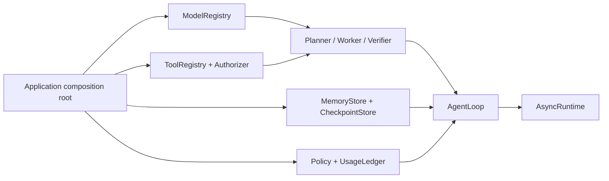
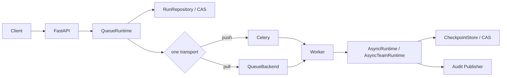

简体中文 | [English](enterprise-integration.en.md)

# 企业集成指南

这份文档面向负责组合根、Worker 和运行基础设施的工程团队。它不重复每个类的字段，而是说明一套
MatterLoop 系统上线时必须做出的选择，以及这些选择之间不能被打破的契约。

如果只想理解 Loop 如何工作，先看[架构说明](architecture.md)。可执行装配在
[`examples/enterprise`](../examples/enterprise/)；具体构造参数在对应发行包 README。

## 先做三个选择

### 运行在哪里

| 形态 | 入口 | 适合 | 代价 |
| --- | --- | --- | --- |
| 嵌入式异步 | `AsyncRuntime` | 已有异步服务、后台任务、测试 | 进程退出会中断活跃运行，除非业务另做接管 |
| 嵌入式同步 | `LocalRuntime` | 脚本、Notebook、同步系统 | 维护专用事件循环线程；不应放进异步请求路径 |
| 多智能体 | `AsyncTeamRuntime` | 能拆成 DAG、需要能力路由和团队验收的任务 | 需要 TeamRepository、控制器租约和幂等 Endpoint |
| 队列执行 | `QueueRuntime` + Worker | API 与长任务分离、跨进程扩缩容 | 需要消息租约、RunRepository CAS、持久 checkpoint 和故障恢复 |

简单任务不要为了“多 Agent”引入 TeamLoop；能在一个进程可靠完成的任务，也不必先搭队列。拓扑
应由故障恢复与吞吐需求决定，而不是由组件数量决定。

### 队列由谁持有消息

Celery 和拉取式 QueueBackend 是两个方案，不是两层队列：

- 已有 Celery 时，`CeleryQueueProducer` 发送 JSON DTO，Celery Worker 持有 Broker 消息。
- 自建 Worker 时，使用 `RedisQueueBackend` 或自定义 `QueueBackend` 的
  `lease/acknowledge/release`。
- Celery 可以搭配 `RedisRunRepository` 与 `RedisEventPublisher`，但不能再让 Redis QueueBackend
  消费同一个运行。

### 哪个存储回答哪个问题

| 数据 | 接口 | 回答的问题 | 不能替代 |
| --- | --- | --- | --- |
| Loop checkpoint | `CheckpointStore` | 计划走到哪一步，如何精确恢复 | RunRepository、长期记忆 |
| 控制面运行记录 | `RunRepository` | 运行当前是什么状态，API 如何查询 | checkpoint |
| Team 状态 | `TeamRepository` | DAG、任务结果、cycle 与哪个控制器持有运行 | Core checkpoint |
| 长期记忆 | `MemoryStore` | Agent 可以检索哪些历史信息 | 任何状态机存储 |
| 审计事件 | `EventPublisher` / `TeamEventPublisher` | 状态为何变化、事件顺序是什么 | 权威状态存储 |

这些接口可以落在同一种数据库里，但要有独立 schema、权限、保留期和事务语义。Redis 集成提供
`RedisCheckpointStore` 的单 Key revision CAS；使用其他数据库时仍须由宿主注入等价持久实现。

## 两种标准部署

### 嵌入式服务



应用启动时创建外部 client，再创建适配器、注册表、Agent、Loop 和 Runtime。请求只提交
`LoopRequest`，不要在每次请求中重新创建 SDK 连接池或 `LocalRuntime` 线程。

### API 与 Worker 分离



`QueueRuntime` 是控制面，不启动 Worker。一个拉取式 Worker 的基本顺序应固定为：

1. 取得消息租约；
2. 用 RunRepository CAS 认领运行；
3. 执行或恢复 Runtime；
4. 用 CAS 写回结果；
5. 成功则 acknowledge，可重试失败则带退避 release。

拿到消息不等于获得状态写入权，CAS 成功也不能撤销已经发生的工具副作用。因此两层机制必须同时
存在。

## 组合根拥有配置和凭据

发行包不读取 `.env`、配置中心或进程环境。推荐启动顺序：

1. 从配置中心和密钥服务加载、校验配置；
2. 创建模型 SDK、Redis/Celery、数据库、HTTP transport 和 OTel provider；
3. 用这些 client 构造 Provider、MCP Session adapter、Store、Publisher 和 Policy；
4. 注册模型、工具与 Agent，最后创建 Runtime；
5. 健康检查通过后再接收流量。

资源关闭按反序进行：停止新流量和投递，排空 Worker 与调用租约，关闭 Runtime 和注册表，最后关闭
应用拥有的连接池与遥测 exporter。

| 对象 | 默认所有者 | 说明 |
| --- | --- | --- |
| 供应商 SDK client | 应用 | Provider 只有 `owns_client=True` 时才关闭它 |
| `ModelRegistry` 中的客户端 | 应用 | `swap/retire` 负责排空，不替你关闭资源 |
| Tool | `ToolRegistry` | 注册、替换、注销和关闭会管理 Tool 生命周期 |
| Runtime `resources` | Runtime | 只关闭构造时明确列出的对象 |
| Redis/Celery/数据库 client | 应用 | 集成适配器不会接管共享连接池 |
| 单次 Celery Worker 依赖 | Worker 工厂返回的 closer | 每次任务结束时关闭 |

热替换时必须先启动新实例，再切流，让旧租约排空后关闭旧实例。不要把“关闭旧实例失败”直接解释
成“替换没有发生”；先查询注册表当前状态。

## 身份、租户和数据边界

认证只证明调用者是谁，授权还要回答“能否访问这个 run、工具和资源”。建议从可信 Principal 派生
`tenant_id` 与 usage scope，并在以下入口重复校验：

- FastAPI 的 create/get/list/cancel/resume/events；
- ToolAuthorizer 的每次参数级决策；
- Memory、checkpoint、RunRepository 与 TeamRepository 的 namespace；
- MCP resource、prompt 和 tool 调用；
- 人工响应的 interaction 与 run 所有权。

`run_id`、`namespace` 和 metadata 都不是授权凭据。不要接受客户端任意指定 tenant namespace，也
不要把邮箱、订单正文或访问令牌编码进 run ID。

模型消息、工具输出、人工反馈、事件和 checkpoint 可能包含业务秘密。API key、Cookie、
Authorization 和数据库凭据不得进入这些数据结构。Provider continuation 虽然不会显示在 repr，
仍然只能留在当前模型事务，不可持久化。

## 工具与外部内容的威胁模型

| 入口 | 已有防线 | 仍需部署方处理 |
| --- | --- | --- |
| `ToolRegistry` | 调用期租约、参数快照、Authorizer 接口 | 默认 Authorizer 全放行；需要身份、租户和参数策略 |
| `FileSystemTool` | root、路径解析、符号链接检查、大小限制 | 同机 TOCTOU、硬链接、权限主体、磁盘配额 |
| `ShellTool` | argv、程序白名单、空环境、超时与输出限制 | 参数语义、网络/系统调用、进程树、恶意代码隔离 |
| `HttpTool` | HTTPS、host/method allowlist、逐跳重定向检查 | DNS rebinding、私网 CIDR、端口、出口和 TLS 身份 |
| MCP | Session 注入、能力协商、分页/内容边界、目录令牌 | transport body 上限、OAuth、远端信任、sampling/elicitation |
| Skills | 只读、allowlist、路径/inode/大小检查 | 来源审核、只读挂载、版本发布和提示注入治理 |

来自网页、文件、MCP resource、Prompt 或 Skill 的内容都应作为不可信参考，不能改变系统权限、审批
规则或预算。`LocalProcessSandbox` 不是恶意代码安全边界；高风险执行要换成容器、虚拟机或远程
Sandbox。

## 并发与幂等

| 边界 | 竞争键 | 正确处理 |
| --- | --- | --- |
| Core 恢复/人工响应 | `run_id + revision` | CAS 失败后重新读取，不覆盖最新 checkpoint |
| 队列状态 | `run_id + version` | Worker 只提交自己认领的版本 |
| Team 控制器 | `run_id + version + owner lease` | 活跃租约拒绝第二个控制器；副作用带 fencing/幂等键 |
| 人工反馈 | `interaction_id + idempotency_key` | 同键同内容 no-op，同键不同内容冲突 |
| 模型/工具热替换 | registry name + invocation lease | 旧事务固定旧实例，新事务使用新实例 |
| Celery 重投 | deterministic task id + RunRecord CAS | task id 用于诊断，CAS 才是执行认领依据 |

所有外部副作用都应使用稳定的业务幂等键，可由 run/task/step 组成。`attempt` 只用于审计；除非每次
尝试本来就应产生独立副作用，否则不要把它纳入去重键。数据库状态 CAS 只能阻止旧结果覆盖，无法
撤回已经发出的邮件、付款或网络请求。

当前 Redis Queue、Celery 运行认领和 TeamRepository 协议都没有通用 heartbeat/renew。租约必须覆盖
端到端最坏执行时间与时钟漂移；超长任务需要扩展续租或拆分任务。

## 预算必须在调用前生效

`UsageLedger` 的 reserve/commit/rollback 用来阻止并行调用一起穿透额度。建议同时设置组织、租户、
运行、任务和 Agent scope：

```text
organization:acme
tenant:tenant-42
team:team-run-id
task:task-id
agent:agent-id
```

在组件注册前包裹 `BudgetedModelClient`、`BudgetedTool`、`BudgetedExecutor` 与
`BudgetedAgentEndpoint`。费用需要应用提供带币种和生效日期的 `TokenRateCard`；MatterLoop 不内置
价格，也不查询供应商账单。

`UsageLedger` 是进程内原子账本。多个 Worker 共享硬额度时，应在这些包装器外接集中式原子预留
服务，或把额度静态切分给 Worker。当前包没有分布式账本实现，production preset 也不补这一层。

## 审计不是普通日志

Core 先 CAS 保存 checkpoint，再发布带连续 sequence 的事件。这样事件对应的状态已经存在，但两者
没有跨系统事务：checkpoint 成功后 Publisher 仍可能失败。不可丢失审计需要宿主扩展统一的
状态与 Outbox 持久化边界，或检测并补偿 sequence 缺口；只替换 Publisher 不够。

`LOG_AND_CONTINUE` 适合可丢失遥测；合规审计通常选择 `RAISE`。Redactor 只按映射键过滤敏感字段，
不会扫描自由文本、模型输出或异常堆栈。日志中建议只保留 run/task/step、tenant、revision/version、
状态、停止原因和用量计数。

OpenTelemetry 的 Provider、Exporter、采样与资源属性应由应用统一配置。若同时给数据库、HTTP 或消息
客户端加自动 instrumentation，创建一个共享 `TracerProvider`，先用 `trace.set_tracer_provider(provider)`
注册它，再通过 `OtelExporter(tracer_provider=provider)` 传给 production preset。这样 MatterLoop 运行、
模型 generation 与数据库/HTTP Span 会在同一条实时 Trace 中；不要使用 `OtelExporter(endpoint=...)` 自动
创建的内部 Provider 做跨组件追踪。关闭顺序是 `runtime.aclose()`、`provider.force_flush()`、
`provider.shutdown()`。Team 事件会携带完整 Snapshot，写入 SIEM 或 Trace 前要评估体积、基数与敏感字段。

需要离线树形 Trace 时，用 `TraceBuilder` 搭配 `BatchingPipeline` 把事件流重建为跨度树并提取验证评分，
模型客户端用 `TracedModelClient` 包装后自动记录 generation 跨度；production preset 传入普通
`trace_exporter` 可完成同样装配，导出流水线随 runtime 关闭自动排空。需要自动 instrumentation 的实时
上下文时使用前述共享 Provider 方案。装配细节见
[matterloop-observability](../matterloop-observability/README.md)。

## 故障演练

上线前不要只跑“成功路径”。至少验证：

| 故障 | 期望结果 |
| --- | --- |
| Worker 在工具副作用后、状态提交前崩溃 | Core 按 `active_operation_id` 保留对账点并进入 `RECOVERY_REQUIRED`，不会盲目重放；确认已有结果后从 `VERIFYING` 继续 |
| 两个请求同时提交人工反馈 | 一个 revision CAS 成功；另一个得到幂等 no-op 或冲突 |
| 模型/工具热替换时仍有长调用 | 旧调用完成，新调用使用新实例，旧资源随后关闭 |
| 审计后端不可用 | 按选定策略阻止推进或明确告警，不静默丢失 |
| 租约早于任务结束 | fencing/幂等机制阻止重复副作用，或测试明确失败暴露配置错误 |
| 任一父子 scope 预算耗尽 | 调用发生前抛硬限额错误，不进入无意义重试 |
| checkpoint/事件 payload 损坏或版本未知 | 严格拒绝，不使用“尽力解析”推进状态机 |

## 当前缺口

- FastAPI 集成没有提交 `HumanResponse` 的路由，也不返回 pending interaction；完整 HTTP HITL 需要
  应用补充受鉴权端点。
- Redis 集成没有长期记忆、Worker、租约续期、TTL 或清理 API；Checkpoint 仅保证单 Key revision CAS。
- Celery 运行认领没有续租；claim lease 必须大于正常最长任务时间。
- 内存 Store、Queue、Repository、UsageLedger 和 TeamRepository 只适合测试或单进程运行。
- production preset 返回控制面与 worker runtime，但不会启动消费循环或部署进程。
- 本地 Sandbox 不提供恶意代码隔离。

## 上线清单

- [ ] 每个外部 I/O 都有超时、有限重试和取消传播。
- [ ] checkpoint、RunRepository 和 TeamRepository 的 CAS 已通过真实后端并发测试。
- [ ] 队列租约、claim lease、Runtime timeout 与 Broker visibility timeout 已统一校准。
- [ ] 工具、Endpoint 和业务副作用都有稳定幂等键。
- [ ] 模型、Token、费用、工具、attempt 和 Agent 任务配置了父子 scope 硬上限。
- [ ] 身份被绑定到 run、namespace、MCP 资源和人工交互，而不只是通过认证。
- [ ] 事件失败策略、Outbox/补偿、脱敏、加密、保留和删除已经评审。
- [ ] shutdown 会停止新流量、排空租约，并关闭应用拥有的连接池。
- [ ] 离线测试、Ruff、mypy、依赖边界、wheel/sdist 和干净环境导入全部通过。
