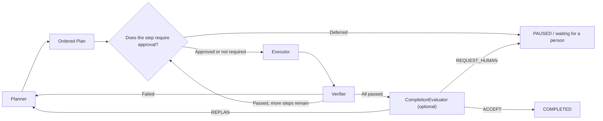

[简体中文](https://github.com/huleidada/matterloop/blob/main/matterloop-core/README.md) | English

# matterloop-core

A recoverable and auditable Loop Engineering kernel. It connects planning, execution, verification,
human feedback, and stopping conditions into a deterministic control flow. It does not include model
SDKs, tools, default policies, or database drivers.

[Architecture](https://github.com/huleidada/matterloop/blob/main/docs/architecture.en.md) ·
[Enterprise integration guide](https://github.com/huleidada/matterloop/blob/main/docs/enterprise-integration.en.md)

```bash
pip install matterloop-core
```

The Python import name is always `matterloop_core`. This package has no third-party runtime
dependencies and does not provide a compatibility package for the former `core` import.

## Minimal runnable assembly

Core never silently selects a Planner, approval rule, or store. The example below supplies a minimal
implementation for every port and uses the in-process checkpoint store from
[`matterloop-memory`](../matterloop-memory/README.en.md). It runs as written. In production, replace
these ports without changing the Loop.

```bash
pip install matterloop-core matterloop-memory
```

```python
import asyncio

from matterloop_core import (
    AgentLoop,
    ApprovalDecision,
    ComponentRegistry,
    ExecutionResult,
    Executor,
    LocalEventPublisher,
    LoopContext,
    LoopRequest,
    LoopStatus,
    Plan,
    Planner,
    PlanStep,
    RetryAction,
    RetryDecision,
    VerificationResult,
    Verifier,
)
from matterloop_memory import InMemoryCheckpointStore


class OneStepPlanner:
    async def plan(self, context: LoopContext) -> Plan:
        return Plan((PlanStep(context.request.goal, executor="echo"),))


class EchoExecutor:
    async def execute(self, step: PlanStep, context: LoopContext) -> ExecutionResult:
        return ExecutionResult(output=f"done: {step.description}")


class PassVerifier:
    async def verify(
        self,
        step: PlanStep,
        result: ExecutionResult,
        context: LoopContext,
    ) -> VerificationResult:
        return VerificationResult(passed=True, evidence=(result.output,))


class AlwaysContinue:
    def can_continue(self, context: LoopContext) -> bool:
        return True


class ApproveSteps:
    async def decide(self, step: PlanStep, context: LoopContext) -> ApprovalDecision:
        return ApprovalDecision.APPROVED


class FailFast:
    def decide(self, error: Exception, attempt: int, context: LoopContext) -> RetryDecision:
        return RetryDecision(RetryAction.FAIL)


async def main() -> None:
    planners = ComponentRegistry[Planner]()
    executors = ComponentRegistry[Executor]()
    verifiers = ComponentRegistry[Verifier]()
    planners.register("default", OneStepPlanner())
    executors.register("echo", EchoExecutor())
    verifiers.register("default", PassVerifier())

    loop = AgentLoop(
        planners=planners,
        executors=executors,
        verifiers=verifiers,
        checkpoint_store=InMemoryCheckpointStore(),
        policy=AlwaysContinue(),
        events=LocalEventPublisher(),
        approval_gate=ApproveSteps(),
        retry_policy=FailFast(),
    )
    result = await loop.run(LoopRequest(goal="Generate a delivery summary"))
    assert result.status is LoopStatus.COMPLETED
    print(result.output)


asyncio.run(main())
```

`AgentLoop` only borrows these components; it does not close them. Components that own connection
pools, model clients, or background tasks should have their lifecycle managed by the application
composition root or by `matterloop-runtime`.

## What the loop actually does



The Planner returns a complete, ordered `Plan` for each cycle. Every `PlanStep` selects its own
`executor`, so one plan can dispatch steps to different executors. The Executor only produces an
`ExecutionResult`; the Verifier decides whether it is correct. A failed verification is still saved
as an `IterationRecord`, and its `feedback` is passed into the next planning cycle.

Passing every step does not necessarily mean that the goal is complete. Inject a
`CompletionEvaluator` when the whole deliverable needs acceptance. It can accept, request replanning,
request human review, or stop. When it is not configured, the run completes after all steps pass.

### cycle, attempt, and step are three independent gates

| Limit | Counting rule | Result when exhausted |
| --- | --- | --- |
| `max_cycles` | Number of Planner calls that create a plan; replanning starts a new cycle | `BLOCKED / CYCLE_LIMIT` |
| `max_attempts` | Total Executor calls in the entire run; exception retries also count | `BLOCKED / ATTEMPT_LIMIT` |
| `max_steps_per_plan` | Number of steps returned by the Planner in one plan; not accumulated across plans | `BLOCKED / STEP_LIMIT` |

`IterationRecord.attempt` is the one-based attempt number within a step.
`LoopContext.total_attempts` is the global Executor-call count. `completed_steps` counts steps for
which an execution and verification record exists. A failed verification increments it as well, so
do not present this field as a count of successful steps.

`timeout_seconds` measures active time, including component calls, retry delays, checkpoints, and
event publication. The clock stops while waiting for a human. Resuming does not reset elapsed time,
cycle count, or attempt count. The controller supervises long component calls and writes
`LOOP_HEARTBEAT` at `heartbeat_interval_seconds`; cancellation and overall timeout drain the
component coroutine before committing the terminal state.

## Approval and human feedback

Only steps with `requires_approval=True` invoke the `ApprovalGate`:

- `APPROVED`: proceed to execution;
- `REJECTED`: return `BLOCKED / APPROVAL_REJECTED` with no pending human request;
- `DEFERRED`: create a `HumanInteractionRequest`, save the current step cursor, and return `PAUSED`.

Submitting a human response and resuming are separate operations. An API or queue can therefore
safely retry “submit decision” without coupling it to a long-running request.

```python
from matterloop_core import HumanAction, HumanResponse, ResumeMode

interaction = paused.pending_interaction
assert interaction is not None

await loop.submit_human_response(
    paused.run_id,
    HumanResponse(
        interaction_id=interaction.interaction_id,
        action=HumanAction.APPROVE,
        idempotency_key="approval-ticket-42",
    ),
)
resumed = await loop.resume(paused.run_id, mode=ResumeMode.CONTINUE)
```

| Human action | Behavior on the next resume |
| --- | --- |
| `APPROVE` | Continue at the exact current step; the approved `step_id` does not pass through the approval gate again |
| `REJECT` | Enter `BLOCKED / HUMAN_REJECTED`; only `REPLAN` can continue the run |
| `REVISE` | `content` is required; save the feedback in history and force replanning |
| `PROVIDE_INPUT` | `content` is required; save the additional input in history and force replanning |

The caller should persist `idempotency_key` and reuse it for network retries. The same key with the
same response is a no-op. Reusing the key while changing the interaction, action, body, or metadata
raises `HumanResponseConflictError`. Core does not guess user intent when `interaction_id` or the
action does not match the pending request.

Whole-run acceptance can also return `REQUEST_HUMAN`. In that case, the person approves the current
completion draft rather than a regular step. The checkpoint still owns the resume state, so the UI
does not need to reconstruct controller state.

## Exact resume, checkpoint CAS, and event ordering

`ResumeMode.CONTINUE` uses `current_plan` and `current_step_index` from the checkpoint and does not
replay steps that already have records. If no unfinished plan exists, it raises
`LoopNotResumableError` instead of silently switching to replanning. `ResumeMode.REPLAN` discards the
current plan and the approval cache for the current cycle, while preserving records, feedback
history, and consumed cycle/attempt counts. Token, cost, and tool quotas belong to an external policy
ledger; persistence across processes depends on the ledger implementation.

`resume()` accepts only `PAUSED` and `BLOCKED`, and any `pending_interaction` must be answered first.
`recover()` handles active checkpoints left by a process crash: `VERIFYING` reuses the persisted
`pending_execution` without invoking the Executor again; `EXECUTING` without a saved result enters
`BLOCKED / RECOVERY_REQUIRED` so the host can reconcile `active_operation_id`, and is never blindly
replayed. An explicit `run_id` is also a submission idempotency key: the same request returns the
existing snapshot, while a different request raises `LoopRequestConflictError`.

The essential `CheckpointStore` contract is not merely “save an object”; it is revision CAS:

```python
new_revision = await store.save(context, expected_revision=context.revision)
assert new_revision > context.revision
```

When two resume requests or two human responses write from the same revision, only one can succeed.
The other receives `CheckpointConflictError` and must reload; it cannot overwrite the winner.
`LoopCheckpointCodec` provides strict schema v2 JSON encoding and decoding:

```python
from matterloop_core import LoopCheckpointCodec

codec = LoopCheckpointCodec()
payload = codec.dumps(context)
restored = codec.loads(payload)
```

Schema v2 stores the plan cursor, records, human history, approved steps, execution operation,
pending verification result, heartbeat, active timing, event sequence, and revision. Older v2
checkpoints that omit the new optional fields decode them as empty. Unknown versions, incorrectly
typed fields, timezone-naive timestamps, or non-JSON metadata raise `CheckpointSchemaError`.

Every state commit follows this fixed order:

1. Update the context and allocate the next continuous `event_sequence`.
2. Save the checkpoint with the previous revision as the CAS condition.
3. After the save succeeds, invoke `EventPublisher` in sequence order.

The state represented by an event has therefore already been saved, but a successful checkpoint
does not guarantee event delivery. Core has no transactional outbox spanning the state store and
messaging system. Production consumers must detect sequence gaps and reconcile them; they must not
treat `LoopEvent.sequence` as exactly-once delivery. `LocalEventPublisher` invokes handlers serially
in subscription order. A handler failure stops subsequent publication and propagates to the
controller.

## Extension protocols and registries

Every port is a `runtime_checkable Protocol`; implementations do not need to inherit from MatterLoop:

| Protocol | Method | Failure handling |
| --- | --- | --- |
| `Planner` | `await plan(context) -> Plan` | An empty plan, duplicate step ID, or exception fails the run |
| `Executor` | `await execute(step, context) -> ExecutionResult` | Ordinary exceptions are passed to `RetryPolicy` |
| `Verifier` | `await verify(step, result, context) -> VerificationResult` | A failed result triggers replanning; an exception fails the run |
| `ApprovalGate` | `await decide(step, context) -> ApprovalDecision` | The decision becomes continuation, blocking, or a human pause |
| `RetryPolicy` | `decide(error, attempt, context) -> RetryDecision` | Handles only Executor exceptions; it may retry, replan, or fail |
| `CompletionEvaluator` | `await evaluate(context) -> CompletionDecision` | Accepts, replans, requests human review, or stops |
| `LoopPolicy` | `can_continue(context) -> bool` | `false` produces `POLICY_REJECTED` at a safe boundary |
| `CheckpointStore` | `save/load` | Must provide atomic CAS; conflicts propagate to the caller |
| `EventPublisher` | `await publish(event)` | Core neither retries nor isolates publication failures |

Core passes an isolated `LoopContext` snapshot to components. Mutating the snapshot does not advance
the real run; components must express outcomes through return values. `LoopPolicy` and `RetryPolicy`
are synchronous decision points and should not perform blocking I/O.

`ComponentRegistry` resolves Planners, Executors, and Verifiers by stable names. Replacement affects
only the next lookup. The registry updates name mappings atomically, but it does not start components,
wait for old calls to drain, or call `aclose()`. For resource-level zero-downtime replacement, use the
container in `matterloop-runtime` or a lease-aware registry owned by the component.

`ComponentSpec`, `PluginDefinition`, and `FactoryCatalog` support deferred construction and Python
Entry Point discovery. Plugin scanning occurs only when `discover()` is called. Bulk installation
creates every instance before updating the registry in one operation, so a factory failure cannot
leave a partially installed plugin.

### `AgentLoop` constructor parameters

| Parameter | Purpose |
| --- | --- |
| `planners` | `ComponentRegistry[Planner]`; the default runtime name is `"default"` |
| `executors` | `ComponentRegistry[Executor]`; resolved from each `PlanStep.executor` |
| `verifiers` | `ComponentRegistry[Verifier]`; the default runtime name is `"default"` |
| `checkpoint_store` | Stores complete recovery state and implements revision CAS |
| `policy` | Decides whether execution may continue at safe boundaries |
| `events` | Receives lifecycle events after the corresponding state is saved |
| `approval_gate` | Handles only steps that declare an approval requirement |
| `retry_policy` | Handles only ordinary exceptions raised by an Executor |
| `completion_evaluator` | Optional; defaults to `None`, which completes immediately after all steps pass |
| `heartbeat_interval_seconds` | Heartbeat persistence interval; defaults to `5.0` seconds and must be finite and positive |
| `cancellation_poll_interval_seconds` | Cancellation polling interval for long calls; defaults to `0.1` seconds and must be finite and positive |

The main methods are `run()`, `resume()`, `recover()`, `submit_human_response()`, and `cancel()`.
`cancel()` takes effect at a safe boundary or at the next supervision poll during a long call. Call
`create_run_id()` first when an associated ID is needed before starting the run.

## Failure boundaries

Callers cannot rely solely on whether an exception was raised. Expected control outcomes normally
appear in `LoopResult`; component or consistency failures normally raise:

| Situation | External behavior |
| --- | --- |
| cycle, attempt, or step limit; policy rejection | `BLOCKED` with the corresponding `StopReason` |
| Approval rejection, human rejection, or whole-run acceptance stop | `BLOCKED` with a structured reason |
| Insufficient local compute quota | `BLOCKED / BUDGET_EXHAUSTED`; does not enter `RetryPolicy` |
| Cooperative cancellation or active timeout | A `CANCELLED` or `TIMED_OUT` result |
| Ordinary Executor exception | Retry, replan, or fail according to `RetryDecision` |
| Unhandled Planner, Verifier, approval, completion, checkpoint, or event exception | Attempt to save `FAILED / COMPONENT_ERROR`, then re-raise |
| Checkpoint revision conflict | Raise `CheckpointConflictError`; do not overwrite newer state |

`BLOCKED` is not terminal, but that does not mean retrying will help. Consumed quotas and counters are
not reset by resume. `LoopResult.output` is the Executor output from the final record; it does not
aggregate all steps. Complete evidence is available in `records`. `error` can contain raw exception
text from business components, so provider adapters and persistence layers must remove sensitive
information first.

<details>
<summary><strong>Public DTO field reference</strong></summary>

These fields are direct dependencies of checkpoints, protocols, and integration layers. Dynamic
defaults are a new UUID hex string or the current UTC time. Every `Mapping` is only shallowly frozen;
its values must still be JSON-serializable when persisted with schema v2.

### Requests and plans

- `LoopLimits`: `max_cycles: int = 5`, `max_attempts: int = 20`,
  `max_steps_per_plan: int = 20`, `timeout_seconds: float | None = None`. The first three values must
  be at least 1; a non-null timeout must be finite and greater than 0.
- `LoopRequest`: required `goal: str`; `acceptance_criteria: tuple[str, ...] = ()`,
  `limits: LoopLimits = LoopLimits()`, `metadata: Mapping[str, object] = {}`. The goal and criteria
  cannot contain blank text.
- `Plan`: `steps: tuple[PlanStep, ...]`. The DTO can be constructed with an empty tuple, but
  `AgentLoop` rejects an empty plan.
- `PlanStep`: required `description: str`; `executor: str = "default"`,
  `acceptance_criteria: tuple[str, ...] = ()`, `requires_approval: bool = False`,
  `step_id: str = <uuid>`. Step IDs must be unique within a plan.

### Execution, verification, and result

- `ArtifactRef`: required `name: str`, `uri: str`; `media_type: str | None = None`,
  `metadata: Mapping[str, object] = {}`. Core does not verify URI authorization or artifact existence.
- `ExecutionResult`: required `output: str`; `artifacts: tuple[ArtifactRef, ...] = ()`,
  `metadata: Mapping[str, object] = {}`. Keep large files in external storage and place only references
  here.
- `VerificationResult`: required `passed: bool`; `feedback: str = ""`, `score: float | None = None`,
  `evidence: tuple[str, ...] = ()`, `failed_criteria: tuple[str, ...] = ()`. `score` is in the range
  0–100; `failed_criteria` must be empty when the result passes.
- `IterationRecord`: required `cycle: int`, `step_index: int`, `step: PlanStep`,
  `execution: ExecutionResult`, `verification: VerificationResult`; `attempt: int = 1`. `step_index`
  is zero-based; the other two counters are one-based.
- `LoopResult`: required `run_id: str`, `status: LoopStatus`, `output: str`, `cycles: int`,
  `total_attempts: int`, `completed_steps: int`, `records: tuple[IterationRecord, ...]`,
  `stop_reason: StopReason | None`; optional `error: str = ""`,
  `pending_interaction: HumanInteractionRequest | None = None`,
  `human_interactions: tuple[HumanInteractionRecord, ...] = ()`,
  `active_operation_id: str | None = None`, `last_heartbeat_at: datetime | None = None`,
  `revision: int = 0`,
  `event_sequence: int = 0`. `iterations` and `feedback_history` are read-only convenience properties.

### Human interaction and control decisions

- `HumanInteractionRequest`: required `kind: HumanInteractionKind`, `prompt: str`;
  `allowed_actions: tuple[HumanAction, ...]` defaults to all four actions,
  `interaction_id: str = <uuid>`, `step_id: str | None = None`,
  `metadata: Mapping[str, object] = {}`, `created_at: datetime = <UTC>`. Allowed actions must be
  non-empty and unique.
- `HumanResponse`: required `interaction_id: str`, `action: HumanAction`; `content: str = ""`,
  `idempotency_key: str = <uuid>`, `metadata: Mapping[str, object] = {}`,
  `responded_at: datetime = <UTC>`. Revision and additional-input actions require non-empty `content`.
- `HumanInteractionRecord`: required `request: HumanInteractionRequest`, `response: HumanResponse`;
  `recorded_at: datetime = <UTC>`. The request and response interaction IDs must match.
- `RetryDecision`: required `action: RetryAction`; `delay_seconds: float = 0`, which must be finite and non-negative.
- `CompletionDecision`: required `action: CompletionAction`; `feedback: str = ""`,
  `interaction: HumanInteractionRequest | None = None`. Only `REQUEST_HUMAN` requires, and may carry,
  an interaction.

### Context, consistency, and plugins

- `LoopContext` identity and progress: required `request: LoopRequest`; `run_id: str = <uuid>`,
  `status: LoopStatus = CREATED`, `records: list[IterationRecord] = []`, `feedback: str = ""`,
  `current_plan: Plan | None = None`, `current_step_index: int = 0`, `cycle_count: int = 0`,
  `total_attempts: int = 0`, `completed_steps: int = 0`.
- `LoopContext` stop state and HITL: `stop_reason: StopReason | None = None`, `error: str = ""`,
  `pending_interaction: HumanInteractionRequest | None = None`,
  `human_interactions: list[HumanInteractionRecord] = []`,
  `approved_step_ids: set[str] = set()`, `replan_required: bool = False`,
  `completion_approved: bool = False`.
- `LoopContext` consistency and time: `event_sequence: int = 0`, `revision: int = 0`,
  `active_operation_id: str | None = None`, `pending_execution: ExecutionResult | None = None`,
  `pending_attempt: int | None = None`, `last_heartbeat_at: datetime | None = None`,
  `active_elapsed_seconds: float = 0`, `active_started_at: datetime | None = None`,
  `started_at: datetime = <UTC>`, `updated_at: datetime = <UTC>`. Extension components receive a
  snapshot and cannot advance the controller by mutating it.
- `LoopEvent`: required `event_type: LoopEventType`, `context: LoopContext`;
  `occurred_at: datetime = <UTC>`, `detail: str = ""`, `sequence: int = 0`. Sequences published by
  the controller increase monotonically within a run.
- `ComponentSpec`: required `name: str`, `factory: Callable[[], T]`; `version: str = "0.1.0"`,
  `capabilities: frozenset[str] = frozenset()`, `description: str = ""`,
  `metadata: Mapping[str, str] = {}`. The factory is excluded from `repr`; metadata must not store
  credentials.
- `PluginDefinition`: required `name: str`, `version: str`,
  `components: tuple[ComponentSpec, ...]`. It must contain at least one component and component names
  must be unique.

</details>

<details>
<summary><strong>Status, stop reason, event, and exception reference</strong></summary>

- `LoopStatus`: `CREATED`, `PLANNING`, `WAITING_APPROVAL`, `EXECUTING`, `VERIFYING`, `PAUSED`,
  `BLOCKED`, `COMPLETED`, `CANCELLED`, `TIMED_OUT`, `FAILED`. Only `COMPLETED`, `CANCELLED`,
  `TIMED_OUT`, and `FAILED` are terminal.
- `StopReason`: `COMPLETED`, `POLICY_REJECTED`, `APPROVAL_REJECTED`, `APPROVAL_DEFERRED`,
  `HUMAN_INPUT_REQUIRED`, `HUMAN_REJECTED`, `COMPLETION_REJECTED`, `CYCLE_LIMIT`,
  `ATTEMPT_LIMIT`, `STEP_LIMIT`, `CANCELLED`, `TIMED_OUT`, `COMPONENT_ERROR`, `BUDGET_EXHAUSTED`.
- `LoopEventType` covers Loop start and stop, planning, approval, execution, verification, human
  feedback, whole-run acceptance, and replanning. Subscribers should deduplicate on
  `(run_id, sequence)` and must not rely on arrival-time ordering.
- Resume and consistency exceptions: `LoopNotFoundError`, `LoopNotResumableError`,
  `CheckpointSchemaError`, `CheckpointConflictError`, `HumanInteractionNotPendingError`,
  `HumanResponseConflictError`.
- Orchestration and registration exceptions: `InvalidPlanError`, `InvalidStateTransitionError`,
  `ComponentNotFoundError`, `ComponentAlreadyRegisteredError`, `InvalidPluginError`.
- `ResourceLimitExceededError` is the stable boundary between budget wrappers and Core. It maps to
  `BLOCKED / BUDGET_EXHAUSTED` and is not sent to the Executor retry policy.

</details>

## Development and verification

Run these commands from the workspace root:

```bash
uv run ruff check matterloop-core
uv run mypy matterloop-core/src/python matterloop-core/tests
uv run pytest matterloop-core/tests
```

The public API is exported through `matterloop_core.__all__` and includes `py.typed`. When changing a
DTO, constructor parameter, or protocol, update the checkpoint schema, resume tests, and documentation
contracts together. Do not stop after an import succeeds from workspace source; also verify the built
wheel.
