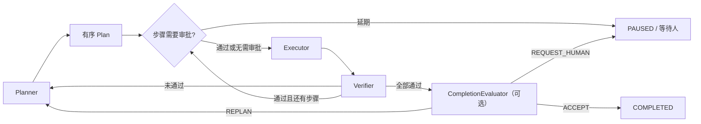

# matterloop-core

可恢复、可审计的 Loop Engineering 内核。它负责把规划、执行、验证、人工反馈和停止条件串成一个
确定性控制流，不包含模型 SDK、工具、默认策略或数据库驱动。

[架构说明](../docs/architecture.md) · [企业集成指南](../docs/enterprise-integration.md)

```bash
pip install matterloop-core
```

Python 导入名固定为 `matterloop_core`。本包没有第三方运行时依赖，也不提供旧的 `core` 兼容包。

## 最小可运行装配

Core 不偷偷选择 Planner、审批规则或存储。下面的示例给每个端口放入一个最小实现，并借用
[`matterloop-memory`](../matterloop-memory/README.md) 的进程内检查点；代码可直接运行，生产环境只需
替换这些端口，不需要改 Loop。

```bash
pip install matterloop-core matterloop-memory
```

```python
import asyncio

from matterloop_core import (
    AgentLoop,
    ApprovalDecision,
    ComponentRegistry,
    ExecutionResult,
    Executor,
    LocalEventPublisher,
    LoopContext,
    LoopRequest,
    LoopStatus,
    Plan,
    Planner,
    PlanStep,
    RetryAction,
    RetryDecision,
    VerificationResult,
    Verifier,
)
from matterloop_memory import InMemoryCheckpointStore


class OneStepPlanner:
    async def plan(self, context: LoopContext) -> Plan:
        return Plan((PlanStep(context.request.goal, executor="echo"),))


class EchoExecutor:
    async def execute(self, step: PlanStep, context: LoopContext) -> ExecutionResult:
        return ExecutionResult(output=f"done: {step.description}")


class PassVerifier:
    async def verify(
        self,
        step: PlanStep,
        result: ExecutionResult,
        context: LoopContext,
    ) -> VerificationResult:
        return VerificationResult(passed=True, evidence=(result.output,))


class AlwaysContinue:
    def can_continue(self, context: LoopContext) -> bool:
        return True


class ApproveSteps:
    async def decide(self, step: PlanStep, context: LoopContext) -> ApprovalDecision:
        return ApprovalDecision.APPROVED


class FailFast:
    def decide(self, error: Exception, attempt: int, context: LoopContext) -> RetryDecision:
        return RetryDecision(RetryAction.FAIL)


async def main() -> None:
    planners = ComponentRegistry[Planner]()
    executors = ComponentRegistry[Executor]()
    verifiers = ComponentRegistry[Verifier]()
    planners.register("default", OneStepPlanner())
    executors.register("echo", EchoExecutor())
    verifiers.register("default", PassVerifier())

    loop = AgentLoop(
        planners=planners,
        executors=executors,
        verifiers=verifiers,
        checkpoint_store=InMemoryCheckpointStore(),
        policy=AlwaysContinue(),
        events=LocalEventPublisher(),
        approval_gate=ApproveSteps(),
        retry_policy=FailFast(),
    )
    result = await loop.run(LoopRequest(goal="生成一份交付说明"))
    assert result.status is LoopStatus.COMPLETED
    print(result.output)


asyncio.run(main())
```

`AgentLoop` 只借用这些组件，不负责关闭它们。持有连接池、模型客户端或后台任务的组件应交给应用
组合根或 `matterloop-runtime` 管理生命周期。

## 闭环到底做了什么



Planner 每轮返回完整、有序的 `Plan`。每个 `PlanStep` 自己指定 `executor`，所以同一计划可以把步骤
交给不同执行器。Executor 只产生 `ExecutionResult`；是否正确由 Verifier 判断。验证失败同样会保存
`IterationRecord`，然后把 `feedback` 带入下一轮规划。

所有步骤通过并不必然等于目标完成。需要整体交付验收时注入 `CompletionEvaluator`；它可以接受、
要求重规划、请求人工复核或停止。未配置时，全部步骤通过即完成。

### cycle、attempt 和 step 是三把不同的闸

| 限制 | 统计口径 | 耗尽结果 |
| --- | --- | --- |
| `max_cycles` | 调用 Planner 生成计划的次数；重规划开启新 cycle | `BLOCKED / CYCLE_LIMIT` |
| `max_attempts` | 整次运行中 Executor 的调用总数；异常重试也计数 | `BLOCKED / ATTEMPT_LIMIT` |
| `max_steps_per_plan` | Planner 当次返回的步骤数，不跨计划累计 | `BLOCKED / STEP_LIMIT` |

`IterationRecord.attempt` 是某一步内部从 1 开始的尝试序号，`LoopContext.total_attempts` 才是全局
Executor 调用数。`completed_steps` 表示已经形成执行和验证记录的数量；验证失败也会增加它，不能把
这个字段显示成“成功步骤数”。

`timeout_seconds` 统计活跃时间，包括组件调用、重试等待、检查点和事件发布。人工暂停期间停止计时；
恢复不会重置已经消耗的时间、cycle 或 attempt。

## 审批和人工反馈

只有 `requires_approval=True` 的步骤才调用 `ApprovalGate`：

- `APPROVED`：进入执行；
- `REJECTED`：返回 `BLOCKED / APPROVAL_REJECTED`，没有待处理人工请求；
- `DEFERRED`：创建 `HumanInteractionRequest`，保存当前步骤游标并返回 `PAUSED`。

人工响应与恢复是两个操作。这样 API 或队列可以安全重试“提交决定”，不会把它和长时间运行绑在
同一个请求中。

```python
from matterloop_core import HumanAction, HumanResponse, ResumeMode

interaction = paused.pending_interaction
assert interaction is not None

await loop.submit_human_response(
    paused.run_id,
    HumanResponse(
        interaction_id=interaction.interaction_id,
        action=HumanAction.APPROVE,
        idempotency_key="approval-ticket-42",
    ),
)
resumed = await loop.resume(paused.run_id, mode=ResumeMode.CONTINUE)
```

| 人工动作 | 下一次恢复 |
| --- | --- |
| `APPROVE` | 精确继续当前步骤；已批准的 `step_id` 不再经过审批门 |
| `REJECT` | 进入 `BLOCKED / HUMAN_REJECTED`；必须选择 `REPLAN` 才能继续 |
| `REVISE` | `content` 必填，意见进入历史并强制重新规划 |
| `PROVIDE_INPUT` | `content` 必填，补充信息进入历史并强制重新规划 |

调用方应持久化 `idempotency_key` 并在网络重试时复用。相同键、相同响应是 no-op；相同键却改变
interaction、动作、正文或 metadata 会抛 `HumanResponseConflictError`。`interaction_id` 或 action
不匹配当前请求时，Core 不会猜测用户意图。

整体完成验收也可以返回 `REQUEST_HUMAN`。此时批准的是当前完成草稿，而不是某个普通步骤；恢复逻辑
仍由检查点保存，不需要在 UI 中重建控制器状态。

## 精确恢复、checkpoint CAS 与事件顺序

`ResumeMode.CONTINUE` 使用检查点中的 `current_plan` 和 `current_step_index`，不会重放已经形成 record
的步骤。缺少未完成计划时会抛 `LoopNotResumableError`，不会悄悄改成重新规划。`ResumeMode.REPLAN`
丢弃当前计划和本轮审批缓存，但保留 records、反馈历史以及已经消耗的 cycle/attempt 计数。Token、
费用和工具额度属于外部策略账本，其跨进程恢复能力由账本实现决定。

恢复入口只接受 `PAUSED` 和 `BLOCKED`，且 `pending_interaction` 必须先被响应。当前版本不会自动接管
崩溃在 `PLANNING`、`EXECUTING` 或 `VERIFYING` 的活跃运行；有副作用的 Executor 仍需使用业务幂等键。

`CheckpointStore` 的关键契约不是“能保存对象”，而是 revision CAS：

```python
new_revision = await store.save(context, expected_revision=context.revision)
assert new_revision > context.revision
```

两个恢复请求或两个人工响应从同一 revision 写入时，只能有一个成功。另一个得到
`CheckpointConflictError` 并重新读取；它不能覆盖胜者。`LoopCheckpointCodec` 提供严格的 schema v2
JSON 编解码：

```python
from matterloop_core import LoopCheckpointCodec

codec = LoopCheckpointCodec()
payload = codec.dumps(context)
restored = codec.loads(payload)
```

v2 保存计划游标、records、人工历史、批准步骤、活跃计时、event sequence 和 revision。未知版本、
错误字段类型、无时区时间或非 JSON metadata 会抛 `CheckpointSchemaError`。

一次状态提交的顺序固定为：

1. 更新上下文并分配连续的 `event_sequence`；
2. 用旧 revision CAS 保存检查点；
3. 保存成功后，按 sequence 调用 `EventPublisher`。

所以事件对应的状态一定已经保存，但检查点成功不代表事件一定送达。Core 没有跨存储和消息系统的
事务型 outbox；生产端应检测 sequence 缺口并做补偿，不能把 `LoopEvent.sequence` 当作恰好一次投递。
`LocalEventPublisher` 只按订阅顺序串行调用 handler，handler 失败会停止后续发布并向控制器传播。

## 扩展协议与注册表

所有端口都是 `runtime_checkable Protocol`，实现类无需继承 MatterLoop：

| 协议 | 方法 | 失败由谁处理 |
| --- | --- | --- |
| `Planner` | `await plan(context) -> Plan` | 空计划、重复 step ID 或异常使运行失败 |
| `Executor` | `await execute(step, context) -> ExecutionResult` | 普通异常交给 `RetryPolicy` |
| `Verifier` | `await verify(step, result, context) -> VerificationResult` | 未通过会重规划；异常使运行失败 |
| `ApprovalGate` | `await decide(step, context) -> ApprovalDecision` | 决策转换为继续、阻塞或人工暂停 |
| `RetryPolicy` | `decide(error, attempt, context) -> RetryDecision` | 只处理 Executor 异常，可重试、重规划或失败 |
| `CompletionEvaluator` | `await evaluate(context) -> CompletionDecision` | 决定接受、重规划、人工复核或停止 |
| `LoopPolicy` | `can_continue(context) -> bool` | false 在安全边界产生 `POLICY_REJECTED` |
| `CheckpointStore` | `save/load` | 必须原子 CAS；冲突向调用方传播 |
| `EventPublisher` | `await publish(event)` | Core 不重试，也不隔离发布失败 |

Core 会给组件传入隔离的 `LoopContext` snapshot。修改 snapshot 不会推进真实运行；组件应通过返回值表达
结果。`LoopPolicy` 和 `RetryPolicy` 是同步决策点，不应在其中执行阻塞 I/O。

`ComponentRegistry` 按稳定名称解析 Planner、Executor 和 Verifier，替换只影响下一次查询。它保证名称
映射原子更新，但不启动组件、不等待旧调用排空，也不调用 `aclose()`。需要资源级无中断替换时使用
`matterloop-runtime` 的容器或对应组件自己的租约注册表。

`ComponentSpec`、`PluginDefinition` 和 `FactoryCatalog` 用于延迟创建和 Python Entry Point 发现。插件
扫描只有调用 `discover()` 时发生；批量安装先创建所有实例，再一次性更新注册表，工厂失败不会留下
半套组件。

### `AgentLoop` 构造参数

| 参数 | 作用 |
| --- | --- |
| `planners` | `ComponentRegistry[Planner]`，默认运行名称为 `"default"` |
| `executors` | `ComponentRegistry[Executor]`，按每个 `PlanStep.executor` 解析 |
| `verifiers` | `ComponentRegistry[Verifier]`，默认运行名称为 `"default"` |
| `checkpoint_store` | 保存完整恢复状态并实现 revision CAS |
| `policy` | 在安全边界决定是否继续 |
| `events` | 接收保存成功后的生命周期事件 |
| `approval_gate` | 只处理声明需要审批的步骤 |
| `retry_policy` | 只处理 Executor 抛出的普通异常 |
| `completion_evaluator` | 可选；默认 `None`，所有步骤通过后直接完成 |

常用方法是 `run()`、`resume()`、`submit_human_response()` 和 `cancel()`。`cancel()` 登记协作式取消，
在下一个安全边界生效；要在启动前拿到关联 ID，可先调用 `create_run_id()`。

## 失败边界

调用方不能只看“有没有抛异常”。可预期的控制结果通常放在 `LoopResult`，组件或一致性错误通常抛出：

| 情况 | 对外表现 |
| --- | --- |
| cycle、attempt、step 上限或策略拒绝 | `BLOCKED` + 对应 `StopReason` |
| 审批拒绝、人工拒绝、整体验收停止 | `BLOCKED` + 结构化原因 |
| 本地计算额度不足 | `BLOCKED / BUDGET_EXHAUSTED`，不进入 `RetryPolicy` |
| 协作式取消或活跃超时 | `CANCELLED` 或 `TIMED_OUT` 结果 |
| Executor 普通异常 | 按 `RetryDecision` 重试、重规划或失败 |
| Planner、Verifier、审批、完成验收、checkpoint、事件的未处理异常 | 尝试保存 `FAILED / COMPONENT_ERROR`，然后重抛 |
| checkpoint revision 冲突 | 抛 `CheckpointConflictError`，不覆盖新状态 |

`BLOCKED` 不是终态，但不代表“重试一定有用”：耗尽的额度和次数不会因 resume 重置。`LoopResult.output`
取最后一条 record 的 Executor 输出，不会聚合所有步骤；完整证据在 `records`。`error` 可能包含业务
组件的原始异常文本，供应商适配器和持久化层必须先处理敏感信息。

<details>
<summary><strong>公共 DTO 字段速查</strong></summary>

以下是 checkpoint、协议与集成层会直接依赖的字段。动态默认值均为新 UUID hex 或当前 UTC；所有
`Mapping` 只冻结顶层，schema v2 持久化时其中的值仍须可 JSON 序列化。

### 请求与计划

- `LoopLimits`：`max_cycles: int = 5`、`max_attempts: int = 20`、
  `max_steps_per_plan: int = 20`、`timeout_seconds: float | None = None`。前三项至少为 1，timeout
  非空时必须大于 0。
- `LoopRequest`：必填 `goal: str`；`acceptance_criteria: tuple[str, ...] = ()`、
  `limits: LoopLimits = LoopLimits()`、`metadata: Mapping[str, object] = {}`。目标和 criteria 不允许
  空白文本。
- `Plan`：`steps: tuple[PlanStep, ...]`。DTO 可被直接构造成空元组，但 `AgentLoop` 拒绝空计划。
- `PlanStep`：必填 `description: str`；`executor: str = "default"`、
  `acceptance_criteria: tuple[str, ...] = ()`、`requires_approval: bool = False`、`step_id: str = <uuid>`。
  同一计划的 step ID 必须唯一。

### 执行、验证与结果

- `ArtifactRef`：必填 `name: str`、`uri: str`；`media_type: str | None = None`、
  `metadata: Mapping[str, object] = {}`。Core 不验证 URI 权限或制品是否存在。
- `ExecutionResult`：必填 `output: str`；`artifacts: tuple[ArtifactRef, ...] = ()`、
  `metadata: Mapping[str, object] = {}`。大文件应留在外部存储，只在这里放引用。
- `VerificationResult`：必填 `passed: bool`；`feedback: str = ""`、`score: float | None = None`、
  `evidence: tuple[str, ...] = ()`、`failed_criteria: tuple[str, ...] = ()`。score 为 0–100；通过时
  failed criteria 必须为空。
- `IterationRecord`：必填 `cycle: int`、`step_index: int`、`step: PlanStep`、
  `execution: ExecutionResult`、`verification: VerificationResult`；`attempt: int = 1`。step index
  从 0 开始，其他两个计数从 1 开始。
- `LoopResult`：必填 `run_id: str`、`status: LoopStatus`、`output: str`、`cycles: int`、
  `total_attempts: int`、`completed_steps: int`、`records: tuple[IterationRecord, ...]`、
  `stop_reason: StopReason | None`；可选 `error: str = ""`、
  `pending_interaction: HumanInteractionRequest | None = None`、
  `human_interactions: tuple[HumanInteractionRecord, ...] = ()`、`revision: int = 0`、
  `event_sequence: int = 0`。`iterations` 与 `feedback_history` 是只读便利属性。

### 人工交互与控制决策

- `HumanInteractionRequest`：必填 `kind: HumanInteractionKind`、`prompt: str`；
  `allowed_actions: tuple[HumanAction, ...]` 默认四种动作，`interaction_id: str = <uuid>`、
  `step_id: str | None = None`、`metadata: Mapping[str, object] = {}`、`created_at: datetime = <UTC>`。
  allowed actions 必须非空且不可重复。
- `HumanResponse`：必填 `interaction_id: str`、`action: HumanAction`；`content: str = ""`、
  `idempotency_key: str = <uuid>`、`metadata: Mapping[str, object] = {}`、
  `responded_at: datetime = <UTC>`。修订和补充输入要求非空 content。
- `HumanInteractionRecord`：必填 `request: HumanInteractionRequest`、`response: HumanResponse`；
  `recorded_at: datetime = <UTC>`。request 与 response 的 interaction ID 必须相同。
- `RetryDecision`：必填 `action: RetryAction`；`delay_seconds: float = 0`，不得为负。
- `CompletionDecision`：必填 `action: CompletionAction`；`feedback: str = ""`、
  `interaction: HumanInteractionRequest | None = None`。只有 `REQUEST_HUMAN` 必须且可以携带 interaction。

### 上下文、一致性与插件

- `LoopContext` 的身份与进度：必填 `request: LoopRequest`；`run_id: str = <uuid>`、
  `status: LoopStatus = CREATED`、`records: list[IterationRecord] = []`、`feedback: str = ""`、
  `current_plan: Plan | None = None`、`current_step_index: int = 0`、`cycle_count: int = 0`、
  `total_attempts: int = 0`、`completed_steps: int = 0`。
- `LoopContext` 的停止与 HITL：`stop_reason: StopReason | None = None`、`error: str = ""`、
  `pending_interaction: HumanInteractionRequest | None = None`、
  `human_interactions: list[HumanInteractionRecord] = []`、`approved_step_ids: set[str] = set()`、
  `replan_required: bool = False`、`completion_approved: bool = False`。
- `LoopContext` 的一致性与时间：`event_sequence: int = 0`、`revision: int = 0`、
  `active_elapsed_seconds: float = 0`、`active_started_at: datetime | None = None`、
  `started_at: datetime = <UTC>`、`updated_at: datetime = <UTC>`。扩展组件拿到的是 snapshot，不能靠
  修改它推进控制器。
- `LoopEvent`：必填 `event_type: LoopEventType`、`context: LoopContext`；
  `occurred_at: datetime = <UTC>`、`detail: str = ""`、`sequence: int = 0`。控制器发布的 sequence
  对单个运行单调递增。
- `ComponentSpec`：必填 `name: str`、`factory: Callable[[], T]`；`version: str = "0.1.0"`、
  `capabilities: frozenset[str] = frozenset()`、`description: str = ""`、
  `metadata: Mapping[str, str] = {}`。factory 不进入 repr，metadata 不应保存凭据。
- `PluginDefinition`：必填 `name: str`、`version: str`、
  `components: tuple[ComponentSpec, ...]`。components 至少一个且名称不可重复。

</details>

<details>
<summary><strong>状态、停止原因、事件和异常速查</strong></summary>

- `LoopStatus`：`CREATED`、`PLANNING`、`WAITING_APPROVAL`、`EXECUTING`、`VERIFYING`、`PAUSED`、
  `BLOCKED`、`COMPLETED`、`CANCELLED`、`TIMED_OUT`、`FAILED`。终态只有 `COMPLETED`、`CANCELLED`、
  `TIMED_OUT` 和 `FAILED`。
- `StopReason`：`COMPLETED`、`POLICY_REJECTED`、`APPROVAL_REJECTED`、`APPROVAL_DEFERRED`、
  `HUMAN_INPUT_REQUIRED`、`HUMAN_REJECTED`、`COMPLETION_REJECTED`、`CYCLE_LIMIT`、
  `ATTEMPT_LIMIT`、`STEP_LIMIT`、`CANCELLED`、`TIMED_OUT`、`COMPONENT_ERROR`、`BUDGET_EXHAUSTED`。
- `LoopEventType` 覆盖 Loop 启停、规划、审批、执行、验证、人工反馈、整体验收和重规划。订阅者应以
  `(run_id, sequence)` 去重，不依赖事件到达时间排序。
- 恢复/一致性异常：`LoopNotFoundError`、`LoopNotResumableError`、`CheckpointSchemaError`、
  `CheckpointConflictError`、`HumanInteractionNotPendingError`、`HumanResponseConflictError`。
- 编排/注册异常：`InvalidPlanError`、`InvalidStateTransitionError`、`ComponentNotFoundError`、
  `ComponentAlreadyRegisteredError`、`InvalidPluginError`。
- `ResourceLimitExceededError` 是预算包装器与 Core 之间的稳定边界，映射为
  `BLOCKED / BUDGET_EXHAUSTED`，不交给 Executor 重试策略。

</details>

## 开发与验证

在 workspace 根目录执行：

```bash
uv run ruff check matterloop-core
uv run mypy matterloop-core/src/python matterloop-core/tests
uv run pytest matterloop-core/tests
```

公共 API 由 `matterloop_core.__all__` 导出并附带 `py.typed`。修改 DTO、构造参数或协议时，同时更新
checkpoint schema、恢复测试和文档契约；不要只让 workspace 源码导入通过，还要验证构建后的 wheel。
